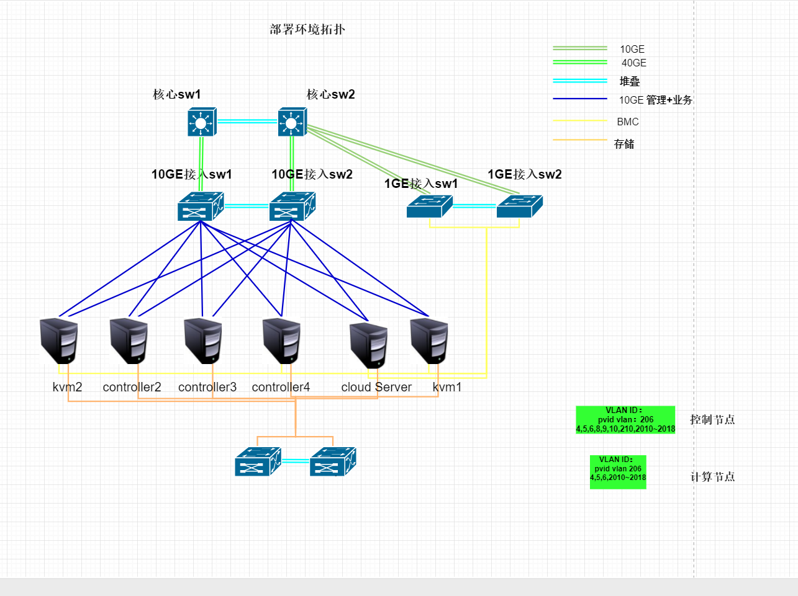

# 华为云FusionCloud6.3.1实施部署

### 设备信息
* 服务器

    华为服务器 64GB 2×900GB 1×RAID卡,4端口千兆网卡 + 万兆双电口*2 × 48

* 48口SAN存储交换机

    浪潮 FS6600，48口 SAN Switch，全激活，配置全部8Gb SFP光模块 × 2

* 网络交换机

     H3C S6800-54QT 交换机 × 4
     48个1G/10G全线速以太网电接口，6个40G以太网光接口，10G堆叠电缆模块1个

## 网络拓扑图：

