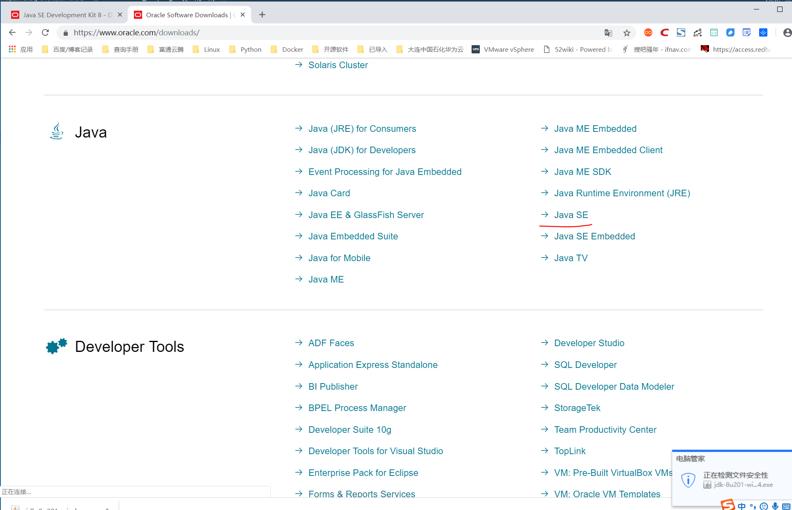
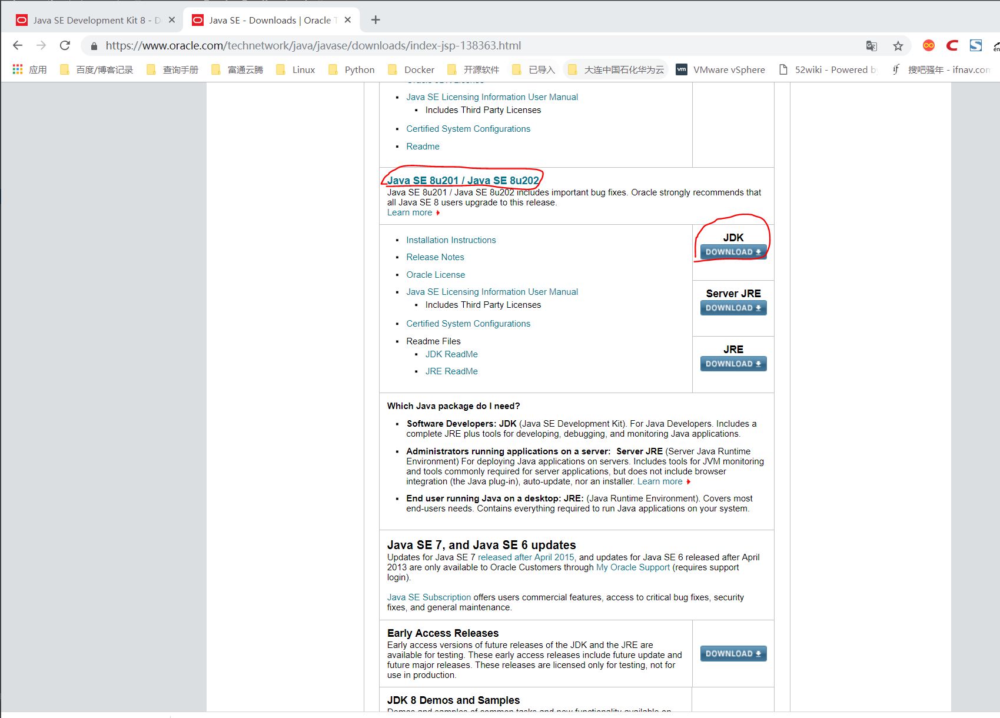
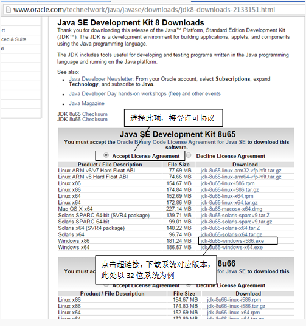

# 搭建Java环境
```
Java的JDK又称Java SE（以前称J2SE），是Sun公司的产本，
由于Sun公司已经被Oracle收购，
因此JDK可以在Oracle公司的官方网站（http://www.oracle.com/index.html）下载。
```


```
打开IE浏览器，
输入网址“http://www.oracle.com/index.html”，

浏览Oracle官方主页。
将标移动到工具栏上的Downloads菜单项上，
将显示下载列表下拉菜单，单击Java for Developers超链接，如下图所示。
```


``` 
将跳转到Java SE的下载页面，在该页面中提供了下载最新版本JDK的超链接，即如下图所示的Download按钮。
```





## 配置环境变量
``` 
在"系统变量"中设置3项属性，JAVA_HOME,PATH,CLASSPATH(大小写无所谓),若已存在则点击"编辑"，不存在则点击"新建"。
变量设置参数如下：

变量名：JAVA_HOME
变量值：C:\Program Files (x86)\Java\jdk1.8.0_91        // 要根据自己的实际路径配置

变量名：CLASSPATH
变量值：.;%JAVA_HOME%\lib\dt.jar;%JAVA_HOME%\lib\tools.jar;         //记得前面有个"."

变量名：Path
变量值：%JAVA_HOME%\bin
变量值：%JAVA_HOME%\jre\bin;
```
