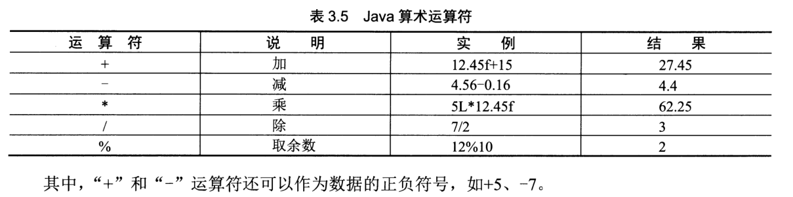
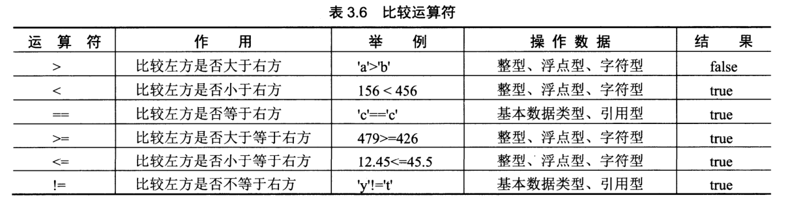
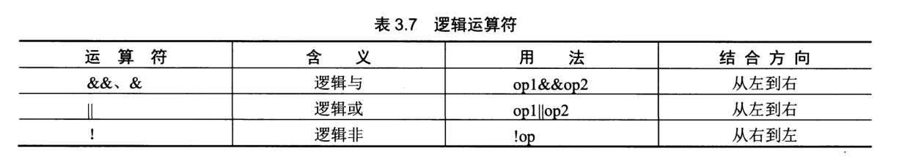
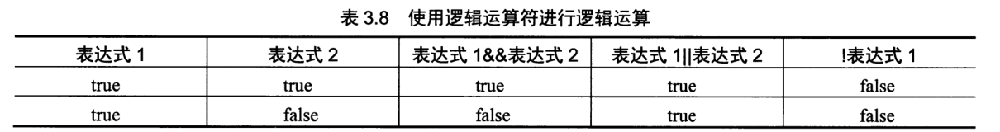
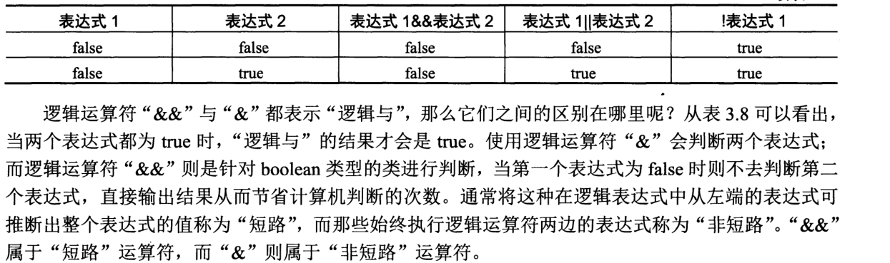
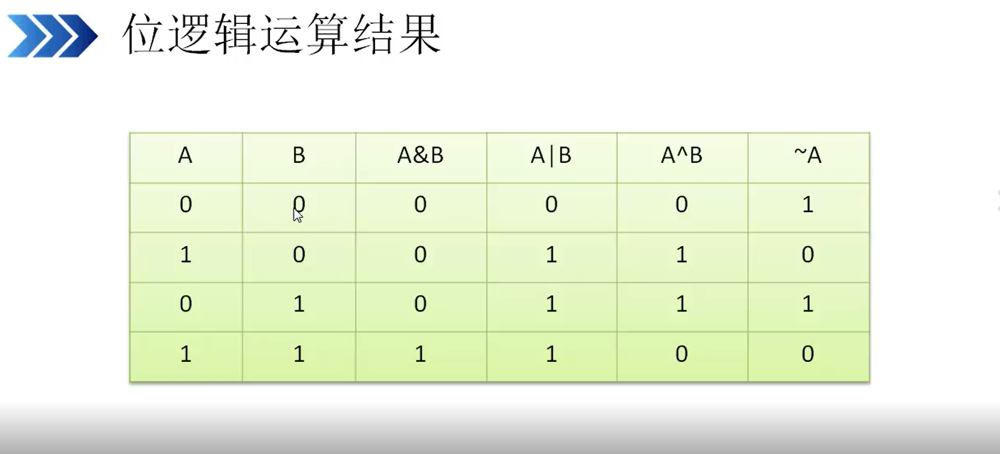
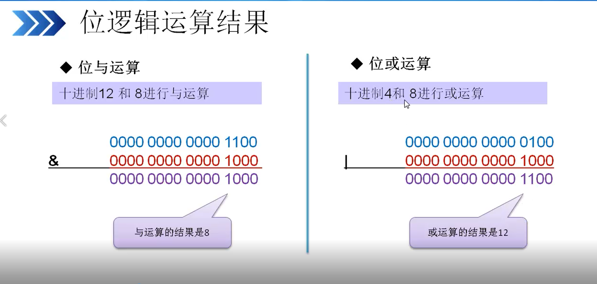
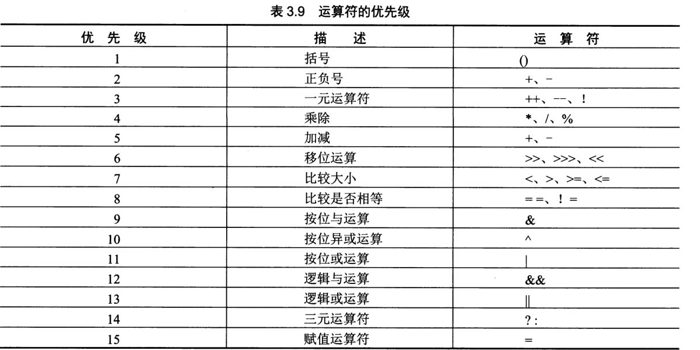
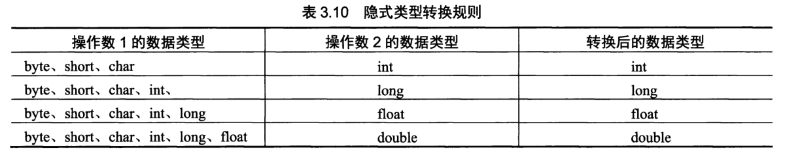

# 运算符
``` 
JAVA中提供丰富的运算符，如：赋值运算符、算术运算符、比较运算符
```
## 赋值运算符
``` 
赋值运算符以符合“=”表示，将右方操作数所含的值赋值给左方
eg:

int a = 100
```
eg:
``` 
package Number;

public class Eval {
	public static void main(String[] args) {
//		声明int a、b、c
		int a,b,c;	
		a=15;
//		a与4的和赋值给b，然后在赋值给c
		c=b=a+4;
		System.out.println("c的值为： " + c);
		System.out.println("b的值为： " + b);
	}

}

```
* 说明：
    
    
    在java中可以把赋值运算符连在一起使用，如：
    x=y=z=5;
    x、y、z都得到同样的值5，开发环境中不建议使用这种赋值语句


## 算术运算符
``` 
java中算术运算符主要有+（加） -（减） *（乘） /（除） %（求余）。都是二元运算符  
```

eg:
``` 
package Number;

public class Arith {
//	创建类
	public static void main(String[] args) {
//		主方法
//		声明float型变量并赋值
		float number1=45.56f;
//		声明int变量并赋值
		int number2=152;
//		开始进行运算
		System.out.println("开始进行运算了.........");
		System.out.println("和为：" + (number1 + number2));		
		System.out.println("差为：" + (number2 - number1));	
		System.out.println("积为：" + (number1 * number2));	
		System.out.println("商为：" + (number1 / number2));	
	}
}

```

## 自增和自减运算符

``` 
自增、自减运算符是单目运算符，可以放在操作元之前，也可以放在操作元之后。
操作元必须是一个整型或浮点型变量。
自增、自减运算符的作用是使变量的值增1或减1.
放在操作元前面，会先加1或减1，然后再使该变量参与表达式的运算
放在操作元后面，会先使变量参与表达式的运算，然后再将变量加1（减1）
```
eg：
```
++a(--a)
a++(a--)
等同于
a=a+1

a=4
b=++a;      //b=5  a=5
b=a++;       //b=4  a=5
```

## 比较运算符

eg:
``` 
package Number;

public class Compare {
//	create class
	public static void main(String[] args) {
//		create main 方法
//		声明int型变量number1
		int number1=4;
//		声明int型变量number2
		int number2=5;
		
//		依次将变量number1与变量number2的比较结果输出 */
		System.out.println("number1 > number2的返回值为： "+ (number1 > number2));
		System.out.println("number1 < number2的返回值为： "+ (number1 < number2));
		System.out.println("number1 == number2的返回值为： "+ (number1 == number2));
		System.out.println("number1 != number2的返回值为： "+ (number1 != number2));
		System.out.println("number1 >= number2的返回值为： "+ (number1 >= number2));
		System.out.println("number1 <= number2的返回值为： "+ (number1 <= number2));
		
		
	}

}


//输出结果信息
number1 > number2的返回值为： false
number1 < number2的返回值为： true
number1 == number2的返回值为： false
number1 != number2的返回值为： true
number1 >= number2的返回值为： false
number1 <= number2的返回值为： true
```

## 逻辑运算符



eg:
``` 
package Number;

class Calculation {
//创建类
	public static void main(String[] args) {
//		创建主方法
//		声明int型变量a、b
		int a=2;
		int b=5;
//		声明boolean型变量，用于保存应用逻辑运算符“&&”后的返回值
		boolean result=((a>b) && (a!=b));
//		声明blllean型变量，用于保存应用逻辑运算符"||"后的返回值
		boolean result2=((a>b) || (a!=b));
		
//		将变量result输出
		System.out.println("result=((a>b) && (a!=b))" + "====>" + result);
//		将变量result2输出
		System.out.println("result2=((a>b) || (a!=b))" + "====>" + result2);
		
	}

}

```

## 位运算符

### 位逻辑运算结果


###  "按位与" 和 "按位或"


### 位移操作
<<: 左移

\>>: 右移

\>>>: 无符号右移


``` 
package Number;

public class Demo {
	public static void main(String[] args) {

		// TODO 自动生成的方法存根
		int a =24;
		System.out.println(a+"右移两位结果:  " + (a>>2));
		
		int b =-16;
		System.out.println(b+"左移三位结果:  " + (b<<3));
		
		int c =-256;
		System.out.println(c+"无符号右移结果:  "+ (c>>>2)); 
		
		/*
		byte a =(byte)(-32>>>1);
		System.out.println(a);
		
		byte b =(byte)(-128>>>4);
		System.out.println(b);
		*/
	}

}

```
* 总结：

位移可以实现整数除以或乘以2的效果，例如 y<<2与y*4的结果相同；

y>>1的结果与y/2的结果相同

总之，一个数左移n位，就是将这个数乘以2；一个数右移n位，就是将这个数除以2。

## 三元运算符
``` 
package Number;

public class sanyuan {

	public static void main(String[] args) {
		// 声明boolean类型变量
		boolean b;
		
//		将20<45作为判断条件
		if(20<45)
//			条件成立true赋值给b
			b=true;	
		else
			b=false;
	
		System.out.println("b的值为："+ b);
	}

}

```

## 运算符优先级

运算符的优先级决定了表达式中运算执行的先后顺序，通常优先级由高到低的顺序依次是：
* 增量和减量运算
* 算术运算
* 比较运算
* 逻辑运算
* 赋值运算

运算符的优先级如下图：



## 数据类型转换
``` 
类型转换是将一个值从一种类型转换为另外一种类型的过程。

数据类型转换有两种方式，即隐式转换与显式转换
```
### 隐式转换
从低级类型向高级类型的转换

顺序为： byte<short<int<long<float<double

隐式类型转换规则


``` 
package Number;

public class Conver {

	public static void main(String[] args) {
//		定义byte型变量，mybyte，并赋值
		byte mybyte = 127;
		int myint = 150;			//定义int型变量，myint，并赋值
		float myfloat = 452.12f;	//定义float型变量，myfloat，并赋值
		char mychar = 10;	//定义char型变量mychar，并赋值
		double mydouble = 45.46546;		//定义double型变量，并赋值
		
		System.out.println("byte型与float型数据进行运算结果为： " + (mybyte + myfloat));
		/*将运算结果输出*/
		
		System.out.println("byte型与int型数据进行运算结果为：" + mybyte * myint);
		System.out.println("byte型与char型数据进行运算结果为：" + mybyte / mychar);
		System.out.println("double型与char型数据进行运算结果为：" + (mydouble + mychar));
	}

}

//输出结果
byte型与float型数据进行运算结果为： 579.12
byte型与int型数据进行运算结果为：19050
byte型与char型数据进行运算结果为：12
double型与char型数据进行运算结果为：55.46546

```
技巧：
    要理解类型转换，这么想象，大脑前面是一片内存，源和目标分别是两个大小不同的内存块（由变量和数据类型决定）

，将源数据赋值给目标内存的过程，就是用目标内存块尽可能多的套取源内存中的数据。


### 显示类型转换
``` 
把高精度的变量的值赋给低精度的变量时，必须适应显式类型转换运算（又称强制类型转换）。

转换时可能会导致精度损失，只要是boolean类型以外其他基本类型之间的转换，
全部都能以显示类型转换的方式达到。
```

```  
package Number;

public class test1 {

	public static void main(String[] args) {
		int a=(int)45.23;
		long y=(long)456.6F;
		int b=(int)'d';
		System.out.println(a);  //45
		System.out.println(y);  //456
		System.out.println(b);  //100

	}

}

//输出结果
45
456
100


```


