# 字符串

## String类

### 声明字符串
* 在Java语言中字符串必须包含在一对双引号（""）之内。例如：
``` 
"23.23" 、"ABCDEF"、"你好"
```
在Java中由双引号（“”）包围的都是字符串，不能作为其他数据类型来使用，如“1+2”的输出，
结果不可能是3.

声明字符串变量：
``` 
String str;
```
+ String: 指定该变量为字符串类型
+ str：任意有效的标识符，表示字符串变量的名称

eg：

声明字符串变量s，实现代码如下：
```
String s; 
```
    声明字符串变量您必须经过初始化才能使用，否则编译器会报出：“变量未被初始化错误”。

### 创建字符串

Java语言中将字符串作为对象来管理，可以像创建其他类对象一样来创建字符串对象。
String类的常用构造方法如下：
    
    （1）String[char a[]]
用一个字符数组a创建String对象


eg：用一个字符数组a创建String对象。
``` 
char a[]={"g","o","o","d"};
String s=new String(a);
```
等价于
``` 
String s = new String("good")
```


    (2) String[char a[].int,offset,int length]
提取字符数组a中的一部分创建一个字符串对象，参数offset表示开始截取字符串的位置，
length表示截取字符串的长度。


eg：提取字符数组a中的一部分创建一个字符串对象
``` 
char a[]={'s','t','u','d','e','n','t'};
String s = new String(a,2,4);


public class String_tes {
	public static void main(String[] args) {
		char[] charArray= {'时','间','就','是','金','钱'};
//		String a = "时间就是金钱，我的朋友。";
		String a=new String(charArray,4,2);	//從索引4開始，截取2个字符
		System.out.println(a);

	}

}
// 输出信息
金钱
```
等价于
``` 
String s = new String("uden");
```

(3) String(char[] value)
该构造方法可分配一个新的String对象，使其表示字符数组参数中所有元素连接的结果。

eg：创建字符数组，将数组中的所有元素连接成一个String对象
    
    char a[]={'s','t','u','d','e','n','t'};
    String s = new String(a);
 
等价于
    
    String s = new String('student');


除了通过以上几种使用String类的构造方法来创建字符串变量外，还可以通过字符串常量的引用
赋值给一个字符串变量

    String str1,str2;
    str1="We are students"
    str2="We are students"

此时str1和str2在内存中指向是同一个地址。

eg:
``` 
public class String_tes {
	public static void main(String[] args) {
		String a = "时间就是金钱，我的朋友。";
		System.out.println(a);
		
		String b="锄禾日当午",c="小鸡炖蘑菇";
		System.out.println(b);
		System.out.println(c);
		
		String str1,str2;
		str1="we are student";
		str2="we are student2";
		System.out.println(str1);
		System.out.println(str2);
	}

}

```


## 连接字符串

### 连接多个字符串
eg:
``` 
public class Join {

	public static void main(String[] args) {
		String s1 = new String("hello");		//声明String对象s1
		String s2 = new String("word");			//声明String对象s2
		String s = s1 + " " + s2;			//将对象s1和s2连接后赋值给s
		System.out.println(s);			//将s输出
		
	}

}

//输出信息
hello word
```
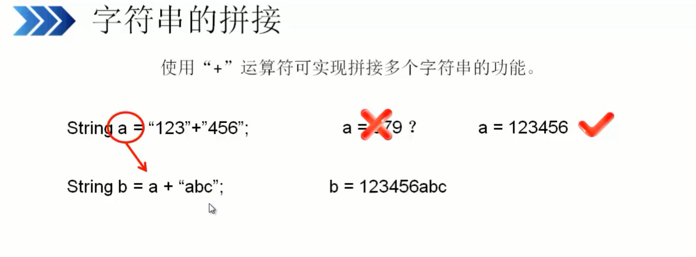
Java中响了的字符串不能分开在两行中写，例如：
    
    System.out.println("I like
        Java");
这种写法是错误的，如果一个字符串太长，为了便于阅读，可以在书写的时候使用“+”。
这样就可以将两个字符串串联起来，之后再加号处换行。
        
            System.out.println("I like" +
        "Java");
        
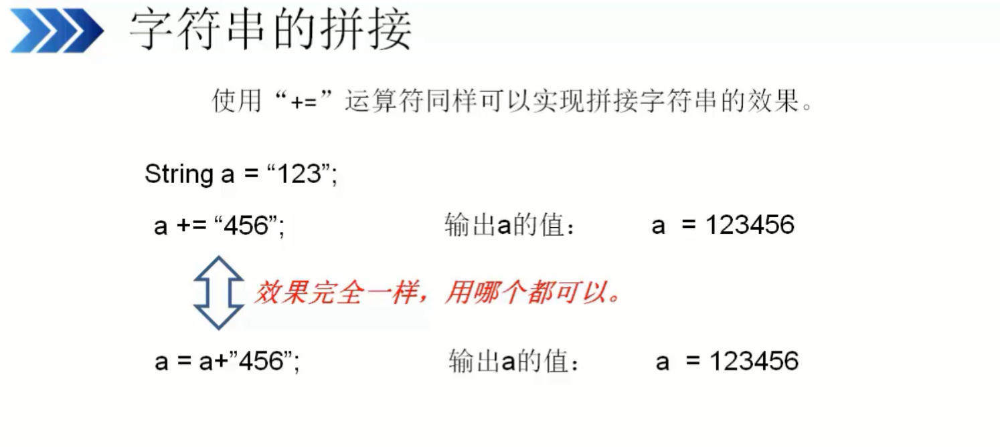
### 连接其他数据类型
字符串也可同其他基本数据类型进行连接。如果将字符串同这些数据类型数据进行连接，会将
这些数据直接转换成字符串。


eg：
``` 

public class Link {

	public static void main(String[] args) {
		int booktime = 4;		//声明的int型变量booktime
		float practice = 2.5f;	//声明的float型变量practice
//		将字符串与整型，浮点型变量相连，并将结果输出
		System.out.println("我每天花费" + booktime + "小时看书;"
				+ practice + "小时上机练习");
	}

}

//输出信息
我每天花费4小时看书;2.5小时上机练习
```
本实例实现的是将字符串常量与整型变量booktime和浮点型变量practice相连后的结果输出。
booktime和practice都不是字符串，当它们与字符串相连时会自动调用toString()方法，
将其转换成字符串形式，然后参与连接。

```
只要“+”运算符的一个操作数是字符串，编译器就会将拧一个操作数转换成字符串形式，所以应谨慎地将
其他数据类型与字符串相连，以免出现意想不到的结果。 
```
``` 
System.out.println("我每天花费" + booktime + "小时看书;"
				+ (booktime + practice) + "小时上机练习");
```

+ 拼接字符串和 +=拼接字符串
eg:
``` 

public class String_tes {
	public static void main(String[] args) {
		String ThepeopleRepublicofChina="中华";
//		ThepeopleRepublicofChina=ThepeopleRepublicofChina + "人民共和国";
		ThepeopleRepublicofChina +="人民共和国";
		System.out.println(ThepeopleRepublicofChina);
	}

}


```

## 获取字符串信息


### 获取字符串长度
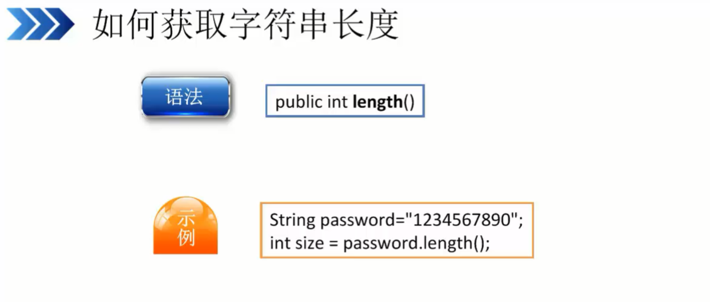
eg:
``` 

public class String_test2 {
public static void main(String[] args) {
	String a="123456789";
	int size=a.length();
	System.out.println("a的长度"+size);
	
}
}
//输出结果
a的长度9

```
注意： 字符串中的空格也会计算到长度里面。


### 获取子字符串
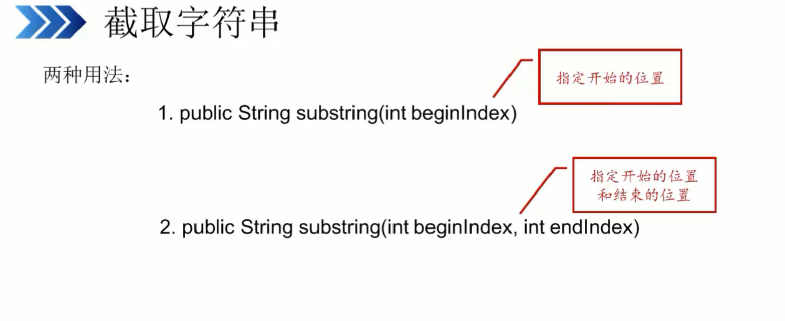
eg
``` 

public class string_substring {
	public static void main(String[] args) {
		String a="422202199407226517";	//定义一个字符串，身份证号码
		String age=a.substring(6);		//使用substring进行截取，从第6位开始截断
		System.out.println(age);		//输出截取后的信息
	}

}
// 输出信息
199407226517

```

eg：
截取开始--结束的区域
``` 

public class string_substring {
	public static void main(String[] args) {
		String a="422202199407226517";	//定义一个字符串，身份证号码
		String age=a.substring(6,14);		//使用substring进行截取，从第6位开始截断
		System.out.println(age);		//输出截取后的信息
	}

}

//输出信息
19940722


```

### 获取指定索引位置的字符串
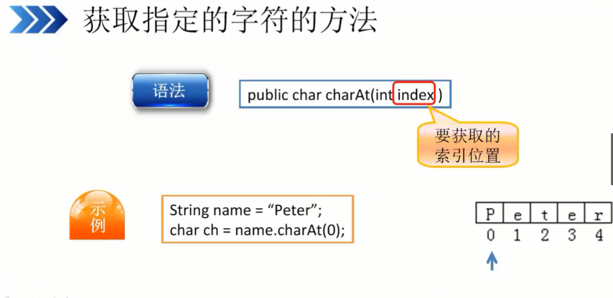

eg:
``` 

public class String_zhiding {
	public static void main(String[] args) {
		String a="HUjianli";
		char b=a.charAt(0);
		System.out.println(b);
	}

}
//输出信息
H
```

#### 获取子字符串索引位置
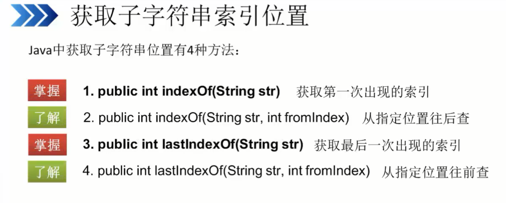

* 获取第一次出现的索引位置
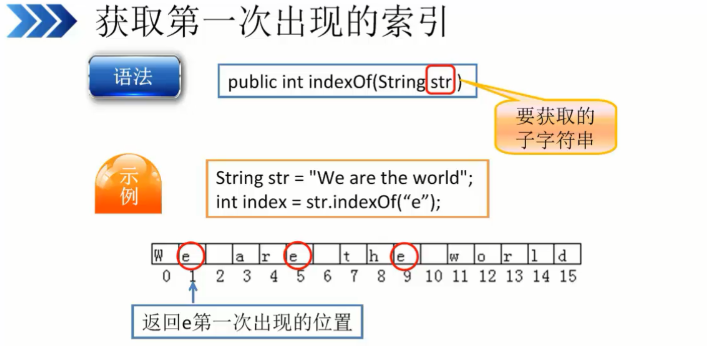
eg1
``` 

public class String_zhiding {
	public static void main(String[] args) {
		String a="HUjianli";		//创建字符串a，并赋值
		int index=a.indexOf("U");	// 创建int型变量index，查找'U'第一次出现的索引位置
		System.out.println(index);	//打印信息
	}

}

```

eg2
``` 

public class String_zhiding {
	public static void main(String[] args) {
		String a="HUjianllllli";		//创建字符串a，并赋值
		int index=a.indexOf("i",4);	// 创建int型变量index，查找'i'从4以后出现的索引位置
		System.out.println(index);	//打印信息
	}

}
```
eg3
``` 

public class String_zhiding {
	public static void main(String[] args) {
		String a="HUjianllllli";		//创建字符串a，并赋值
		int index=a.lastIndexOf("i");	// 创建int型变量index，查找'i'最后一次出现的索引位置
		System.out.println(index);	//打印信息
	}

}

```

### 去除空格
trim()方法返回字符串的副本，忽略前导空格和尾部空格
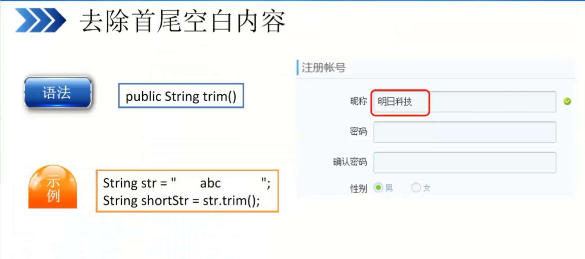
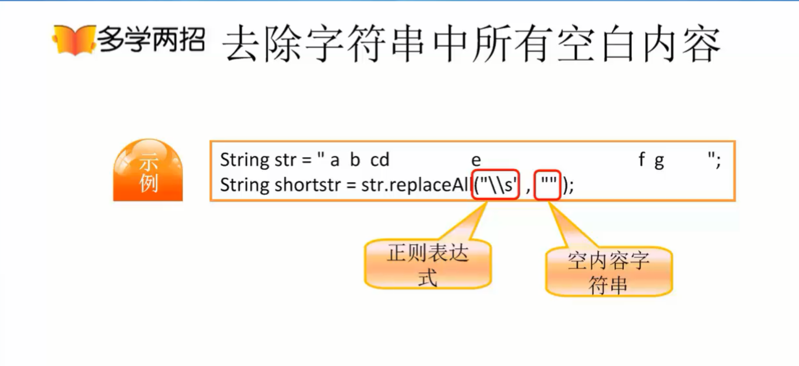
eg1:
``` 

public class String_test3 {
	public static void main(String[] args) {
		String test="     hujianli     ";		//定义一个首位都有空格的字符串，不规则
		System.out.println(test);			//输出
		System.out.println("["+test+"]");		
		System.out.println("字符串test的长度为: "+ test.length());  //计算字符串的长度
		System.out.println("\n");
		String test_rstrip=test.trim();				//使用trim方法，去掉首位的空格
		System.out.println("["+ test_rstrip +"]");	
		System.out.println("字符串去掉空格之后的长度为：" + test_rstrip.length()); //打印去掉空格之后的字符串长度
		
	
	}

}

//输出信息
     hujianli     
[     hujianli     ]
字符串test的长度为: 18


[hujianli]
字符串去掉空格之后的长度为：8
```

eg2
``` 

public class String_test3 {
	public static void main(String[] args) {
		/*
		String test="     hujianli     ";		//定义一个首位都有空格的字符串，不规则
		System.out.println(test);			//输出
		System.out.println("["+test+"]");		
		System.out.println("字符串test的长度为: "+ test.length());  //计算字符串的长度
		System.out.println("\n");
		String test_rstrip=test.trim();				//使用trim方法，去掉首位的空格
		System.out.println("["+ test_rstrip +"]");	
		System.out.println("字符串去掉空格之后的长度为：" + test_rstrip.length()); //打印去掉空格之后的字符串长度
		*/
		String test1="		hu 	jian li    		  ";
		System.out.println("["+ test1+"]");
		System.out.println("字符串test的长度为: "+ test1.length());
		System.out.println("\n");
		
		System.out.println("使用re方法");
		String test2=test1.replaceAll("\\s", "");	//使用正则表达式将中间和两边的空格替换为空
		System.out.println("["+test2+"]");
		System.out.println("字符串的长度为："+ test2.length());
	
	}

}

//输出信息
[		hu 	jian li    		  ]
字符串test的长度为: 21


使用re方法
[hujianli]
字符串的长度为：8

```

### 字符串替换
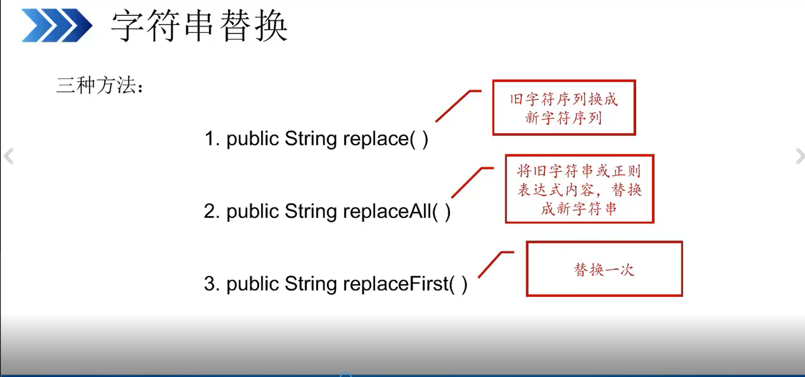
eg:
``` 

public class String_test4 {
	public static void main(String[] args) {
		String str="馒头一文一个。";
		String repleace_str=str.replace("一", "壹");
		System.out.println(repleace_str);
	}

}
//输出结果
馒头壹文壹个


replaace会将str中所有的 oldChar替换为newChar。如果oldChar没有出现在对象表达式的字符串
序列中，则将原字符串返回。
```

### 判断字符串的开始与结尾
* 判断字符串尾内容
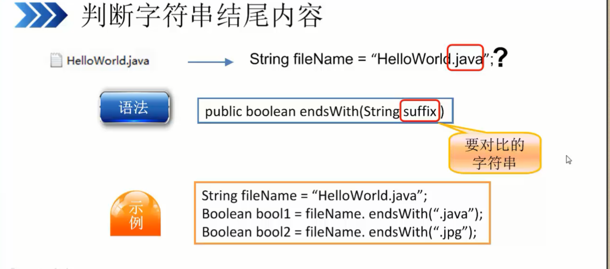

``` 

public class String_test4 {
	public static void main(String[] args) {
		String file="test.java";
		boolean bool1=file.endsWith(".java");
		boolean bool2=file.endsWith(".py");
		System.out.println("bool1 = "+bool1);
		System.out.println("bool2 = "+bool2);
		
	}

}

```

* 判断字符串句首内容

语法
public boolean startsWith(Strin prefi ）
prefi:要对比的字符串

```
string str = “ 新华社记者从前往发来报道． “
B001ean booll = str. startsWith(" 新华社");
B001ean b0012 = st r. startsWith(" 新华书店");
``` 
eg2
``` 

public class String_test4 {
	public static void main(String[] args) {
		String file="新华社记者从前方发来报道...";
//		判断字符串句首内容
		boolean bool1=file.startsWith("新华社");
		boolean bool2=file.startsWith("新华书店");
		System.out.println("bool1 = "+ bool1);
		System.out.println("bool2 = "+ bool2);

		
	}

}

```
### 判断字符串是否相等
- 如何判断字符串内容是否相等

语法

public boolean equaIs(Strin anotherStrin ）

anotherStrin: 被比较的字符串

```
String name = new String("tom");
String dbVaIue = new String("tom");
boolean b0 = name.equals(dbValue);
```

eg:
``` 

public class String_test5 {
public static void main(String[] args) {
	String var_name=new String("hujianli");
	String db_value =new String("hujianli");
	System.out.println("var_name == db_value  " + (var_name == db_value));
	System.out.println("var_name eque db_value  "+ (var_name.equals(db_value)));
	
}
}
// 输出结果
var_name == db_value  false
var_name eque db_value  true

```
- 忽略大小写比较

语法

public boolean equaIsIgnoreCase(Strin anotherStrin ）

anotherStrin 被比较的字符串
```
String strl = new String("abc");
String str2 = new String("ABC");
boolean bOOI = str1.equaIsIgnoreCase(str2);
```
eg
``` 
public class String_test5 {
public static void main(String[] args) {
	String var_name=new String("HUjIANLI");
	String db_value =new String("hujianli");
	System.out.println("var_name == db_value  " + (var_name == db_value));
	System.out.println("var_name eque db_value  "+ (var_name.equals(db_value)));
	System.out.println("两个值进行比较，忽略大小写:  " +(var_name.equalsIgnoreCase(db_value)) );
}
}

//输出结果
var_name == db_value  false
var_name eque db_value  false
两个值进行比较，忽略大小写:  true


```

字符串的定义中，new String()和String内存指向区别,如下：
``` 

public class String_test6 {
public static void main(String[] args) {
	String var1=new String("hujianli");	//指向不同的堆，划分到不同的栈，内存空间不一样
	String var2=new String("hujianli");
	System.out.println("var1 == var2 " + ((var1 == var2)));
	
	String str1="hujianli1"; //相同的引用，指向同一个堆，内存空间一致
	String str2="hujianli1";
	System.out.println("str1 == str2 " + (str1 == str2));
	
	
}
}
// 输出结果
var1 == var2 false
str1 == str2 true
```

### 按字典顺序比较两个字符串
compareTo()方法为按字典顺序比较两个字符串，该比较基于字符串中各个字符的Unicode值，
按字典顺序将此String对象表示的字符序列与参数字符串锁表示的字符序列进行比较。
eg:
``` 

public class Wordbook {
public static void main(String[] args) {
//	主方法
//	用于比较的3个字符串
	String str=new String("b");
	String str1=new String("a");
	String str2=new String("c");
	//将str与str2比较的结果输出
	//b大于a，输出1，b小于c，输出-1
	System.out.println(str+"compareTo " + str1 +"." + str.compareTo(str1));
	System.out.println(str+"compareTo " + str2 +"." + str.compareTo(str2));
}
}

```
### 字符串大小写转换
* 大小写转换


//字符串变成大写：
public String t0UpperCase()


//字符串变成小写：
public String t0LowerCase()
```
String str = "abc DEF"•
String strLow = str.toLowerCase();
String strUp = str.toUpperCase();

```
eg
``` 

public class String_low_upper {
public static void main(String[] args) {
	String str1="hujianli abcdefg"; //定义String'型字符串，并赋值str1
	String str2="HUJIANLI hssddaa"; //定义String'型字符串，并赋值str2
	
	String str_low=str1.toLowerCase();	//将字符串转换为小写
	String str_upper=str2.toUpperCase();	//将字符串转换为大写
	
	System.out.println(str_low);
	System.out.println(str_upper);
}

}

//输出结果
hujianli abcdefg
HUJIANLI HSSDDAA

```
注意：使用toLowerCase()方法和toUpperCase()方法进行大小写转换时，数字或者非字符不受影响。


### 字符串分割
字符串分割

将字符串按照指定的符号分割成数组
```
语法
public String[] split(Strin regex ）

用于分割符号
String str = "abc,def, ghi";
String[] strArray = str.split(",");
```
eg:
``` 
public class String_split {
public static void main(String[] args) {
	String str=new String("abc,def,vbff");
	String[] strArray = str.split(",");     //创建字符串数组
	for (String tmp:strArray) {
		System.out.println(tmp);
		
	}
}
}
// 输出结果
abc
def
vbff
```

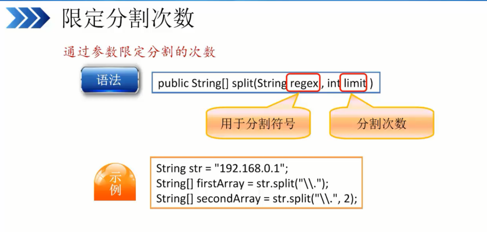
eg
``` 

public class String_split {
public static void main(String[] args) {
	String ip="192.168.10.1";		// 定义字符串变量
	String[] arry1=ip.split("\\.");		//定义数组arry1，使用.进行分割，反复分割
	String[] arry2=ip.split("\\.",2);	//定义数组arry2，使用.进行分割，分割2次
	for(String tmp:arry1) {			//遍历输出tmp
		System.out.print("["+tmp+"]");
	}
	
	System.out.println();
	for(String tmp:arry2) {
		System.out.print("["+tmp+"]");
		
	}
	}
}

//输出结果
[192][168][10][1]
[192][168.10.1]
```

## 格式化字符串

### 日期和时间的格式化
String类的静态format()方法用于创建格式化的字符串。format()方法有两种重载形式。

格式化字符串

语法
String.format(String format,Object...args)

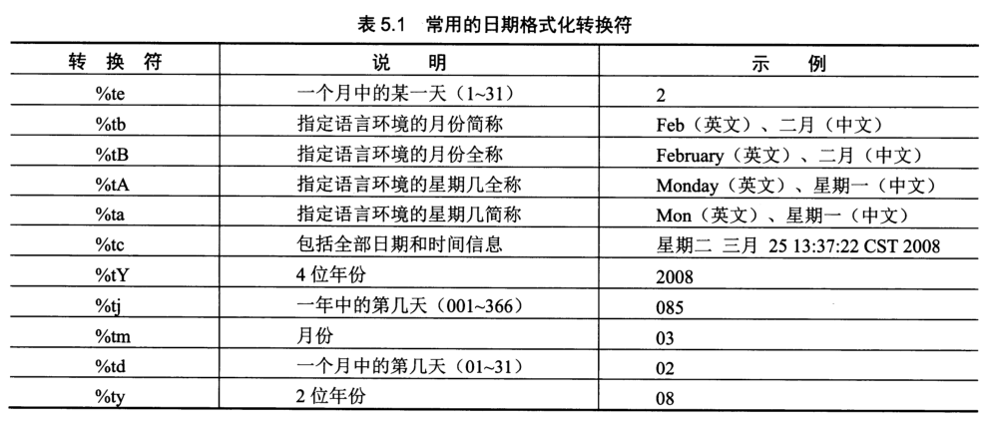
```
Date date=new Date();
String Str = String.format("%tF ” ,date);
```
eg
``` 
import java.util.Date;	//导入java的Date类


public class String_format {
	public static void main(String[] args) {
		Date date = new Date();
//		String str=String.format("%tF",date);
////		System.out.println(date);
//		System.out.println(str);
		
		String Year=String.format("%tY",date);
		String Month=String.format("%tB",date);
		String Day=String.format("%td",date);
		
		String Hour=String.format("%tH", date);
		String Minute=String.format("%tM", date);
		String Second=String.format("%tS", date);
		
		System.out.println("今年是："+Year);
		System.out.println("现在是："+Month);
		System.out.println("今天是："+Day+"日");
		System.out.println("现在的时间是： " +Hour+"时"+Minute+"分"+Second+"秒");
		
		String str=String.format("%tF",date);
		String str1=String.format("%tD",date);
		String str2=String.format("%tc",date);
		String str3=String.format("%tr",date);
		System.out.println("tF格式时间："+str);
		System.out.println("tD格式时间："+str1);
		System.out.println("tc格式时间："+str2);
		System.out.println("tr格式时间："+str3);
	}

}


// 输出结果
今年是：2019
现在是：四月
今天是：12日
现在的时间是： 17时22分38秒
tF格式时间：2019-04-12
tD格式时间：04/12/19
tc格式时间：星期五 四月 12 17:22:38 CST 2019
tr格式时间：05:22:38 下午

```
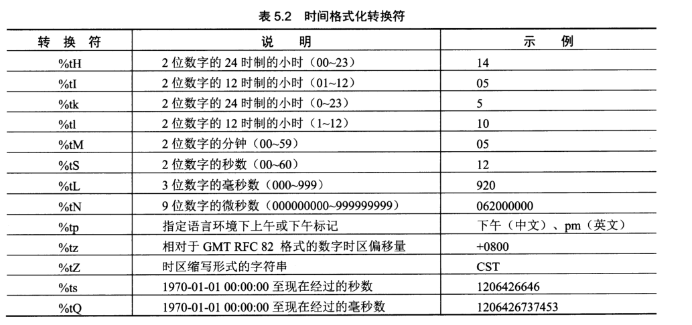


### 常规的类型格式化
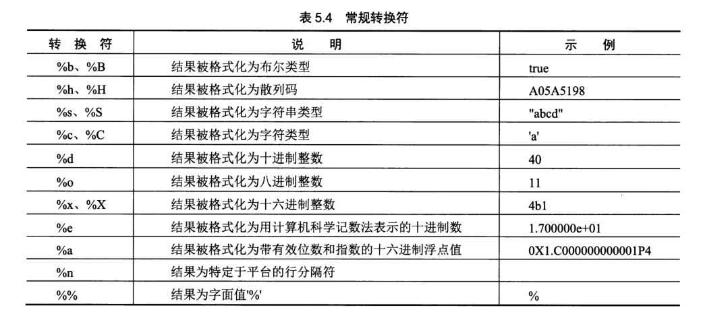
eg
``` 

public class String_changgui {
	//主类
	public static void main(String[] args) {
//		主方法
		String str1 = String.format("字母x大写 :%s", "XXXX");
		System.out.println(str1);
	
		System.out.println(String.format("1251+3955的结果是:%d", 1251+3955));
		System.out.println(String.format("n取2位小数点：%.2f", Math.PI));
		System.out.println(String.format("2<3的结果：%b", 2<3));
		System.out.println(String.format("12000000.1用科学计数法表示:%e", 1200000.1));
		System.out.println(String.format("天才是由 %d%% 的灵感和 %d%% 的汗水组成的。", 1,99));
		
	}

}

// 输出结果
字母x大写 :XXXX
1251+3955的结果是:5206
n取2位小数点：3.14
2<3的结果：true
12000000.1用科学计数法表示:1.200000e+06
天才是由 1% 的灵感和 99% 的汗水组成的。
```


## 使用正则表达式
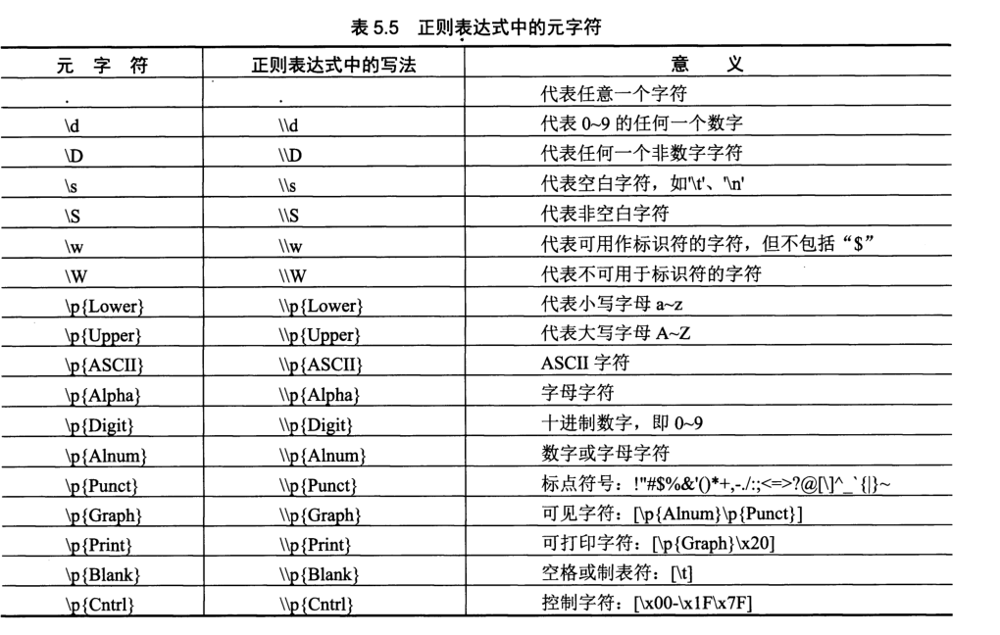
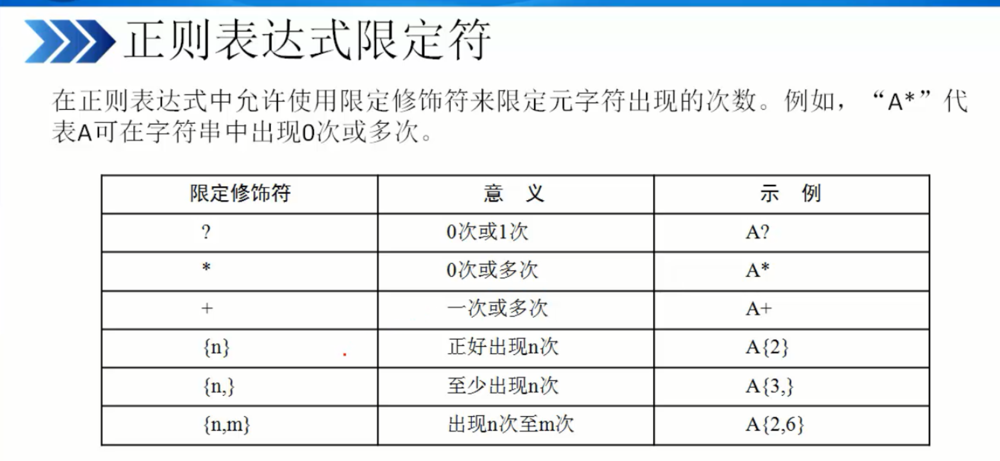)
eg:
``` 

public class re_youxiang {
	//主类
//	主方法
	public static void main(String[] args) {
		String regex="\\w+@\\w+(\\.\\w{2,3})*\\.\\w{2,3}";
		String str1="111";
		String str2="123@";
		String str3="hujianli@163.vip.com";
		String str4="huxiaojian@126.com";
		//		判断字符串变量是否与正则表达式匹配
		if(str1.matches(regex)) {
			System.out.println(str1+"是一个合法的邮箱。。。");
			
		}
		else {
			System.out.println(str1+"不是一个合法的邮箱。。。");
		}
		
		if(str2.matches(regex)) {
			System.out.println(str2+"是一个合法的邮箱。。。");
			
		}
		else {
			System.out.println(str2+"不是一个合法的邮箱。。。");
		}
		if(str3.matches(regex)) {
			System.out.println(str3+"是一个合法的邮箱。。。");
		}
		else {
			System.out.println(str3+"不是一个合法的邮箱。。。");
		}
		if(str4.matches(regex)) {
			System.out.println(str4+"是一个合法的邮箱。。。");
			
		}
		else {
			System.out.println(str4+"不是一个合法的邮箱。。。");
		}
	}

}
//输出结果
111不是一个合法的邮箱。。。
123@不是一个合法的邮箱。。。
hujianli@163.vip.com是一个合法的邮箱。。。
huxiaojian@126.com是一个合法的邮箱。。。

```

### 字符串生成器
"+"可以达到附加新字符串或者字符串的目的，但是会产生一个新的String实例。
J2SE5.0新增了可变的字符序列String-Builder类，大大提高了平凡增加字符串的效率

#### String-Buffer类
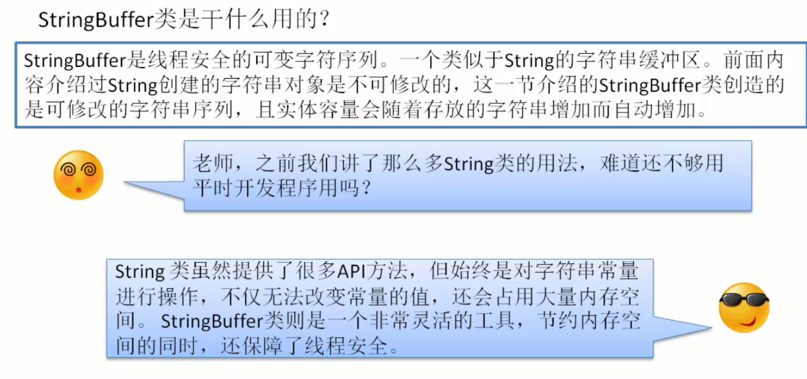
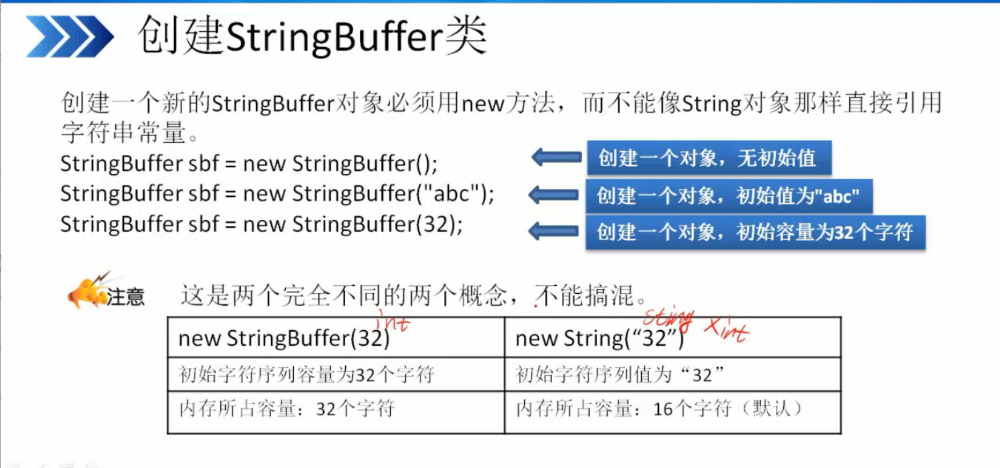
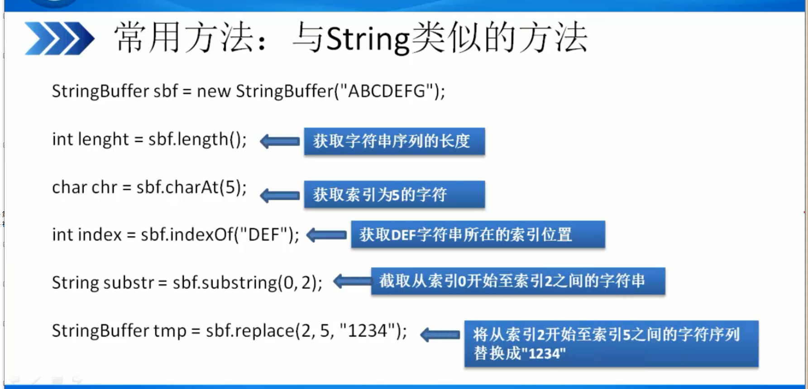

#### String-Builder类
- 注意：
String-Builder类的运行效率比String-Buffer高。兼容String-Buffer类，不保证线程同步，适合单线程，不会
给线程进行加锁。运行效率高

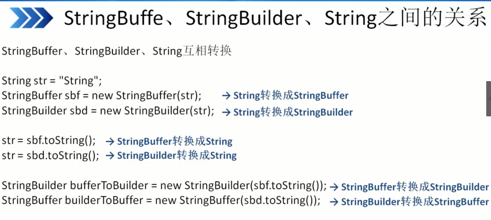
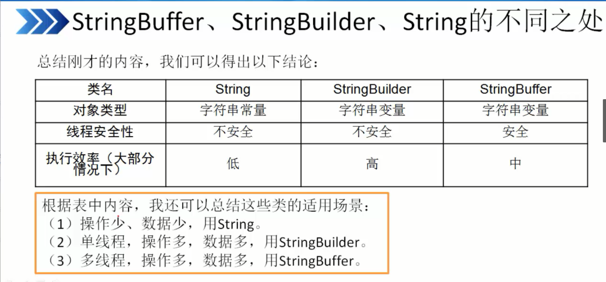
eg
``` 

public class String_buffer {
	public static void main(String[] args) {
		StringBuffer hu= new StringBuffer("古诗春晓");
		
//		使用delete方法删除索引字符串
		hu = hu.delete(0, 2);
		System.out.println(hu.toString());
		
//		使用inset方法增加索引字符串
		hu = hu.insert(1, "眠不觉晓");
		System.out.println(hu.toString());
		
//		使用append来增加字符串
		hu = hu.append(",处处闻啼鸟。");
		System.out.println(hu.toString());
	}

}

// 输出结果
春晓
春眠不觉晓晓
春眠不觉晓晓,处处闻啼鸟。
```

## 课后练习
- 1.使用String类的toUpperCase()方法和toLowerCase()方法实现大小写转换。
``` 

public class test1 {
	public static void main(String[] args) {
		String str1= new String("hujianli day3 shiyan");		//定义string型变量，并赋值
		String str2= new String("HUJIANLI DAY3 SHIIYAN");
		
		//使用toUpperCase()方法和toLowerCase()方法进行转换
		String to_str1_upper = str1.toUpperCase();
		String to_str2_low = str2.toLowerCase();
		
		//输出转换后的信息
		System.out.println();
		System.out.println("开始大小写转换.............");
		System.out.println(str1+" 转换为大写后：" + to_str1_upper);
		System.out.println(str2+" 转换为小写后：" + to_str2_low);
	}

}
```
2. 分别截取字符串str1和字符串str2中的部分内容，如果截取后的子串内容相同(不区分大小写)，输出相同
否则输出不相同。
``` 

//新建class
public class test2 {
//	主方法
	public static void main(String[] args) {
//		定义2个string型变量，并赋值
		String str1 = new String("这是一个测试str1字符串");
		String str2 = new String("这是一个测试str2字符串");
//		进行截取子字符串
		String str1_jiequ = str1.substring(0, 6);
		String str2_jiequ = str2.substring(0, 5);
//		开始判断是否相同
		if (str1_jiequ.equalsIgnoreCase(str2_jiequ)) {
			System.out.println(str1_jiequ + " and " + str2_jiequ + "内容相同!");

		} else {
			System.out.println(str1_jiequ + "and" + str2_jiequ + "内容不同!");
		}

	}

}

```

3. 使用正则表达式来判断字符串text是否为合法的手机号
``` 

public class test_number {
	public static void main(String[] args) {
//		設置正則表達式
		String regex="[1][3,4,5,7,8][0-9]{9}";
//		设置变量
		String text="15000000000";
		if(text.matches(regex)) {
			System.out.println(text + "是合法的手机号。");
		}
	}

}

```
3.使用字符串生成器，将字符串str追加1~10，这10个数字。
``` 

public class test4 {
	public static void main(String[] args) {
		//使用Stringbuffer类定义字符串变量，设置为1
		StringBuffer number=new StringBuffer("字符串str +");
		
		for (int i = 1; i < 10; i++) {
			number.append(i);
			
		}
		System.out.println(number.toString());
		
		
	}

}

```


