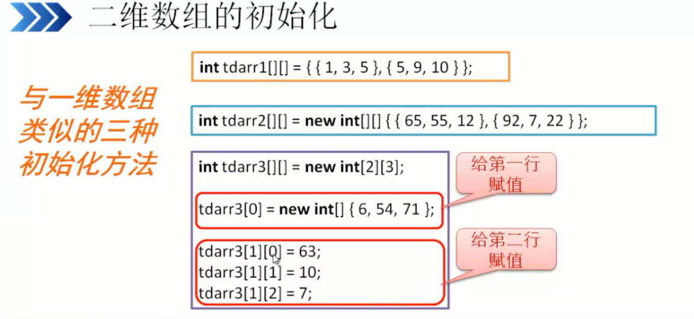
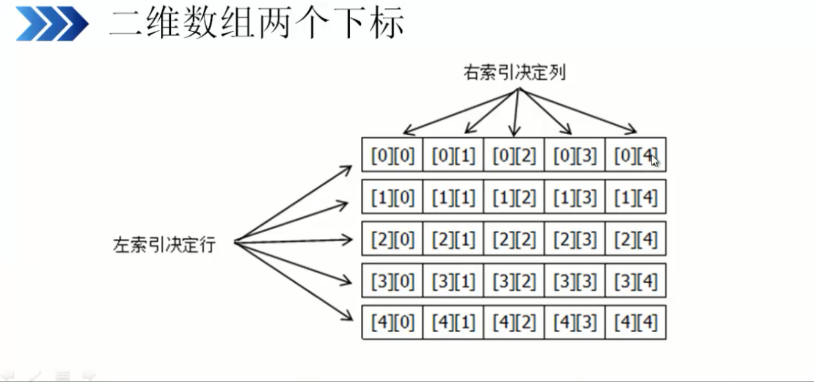

# 二维数组的创建和使用
## 创建二维数组


## 二维数组初始化


## 二维数组的下标


eg
``` 


public class Deam2 {
	public static void main(String[] args) {
//		定义一个二维数组，行数为4行
		char arr[][] = new char[4][];
//		对二维数组的每一行进行赋值
		arr[0]=new char[] {'春','明','不','觉','晓'};
		arr[1]=new char[] {'处','处','闻','啼','鸟'};
		arr[2]=new char[] {'夜','来','风','雨','声'};
		arr[3]=new char[] {'花','落','知','多','少'};
		
	System.out.println("-----------横版------------------------");
//	遍历数组 i为横向下标， 行 0、1、2、3
	for (int i = 0; i < arr.length; i++) {
//		System.out.println(i);
//		遍历数组j，纵向下标，列 0、1、2、3、4
		for (int j = 0; j < arr[i].length; j++) {
			System.out.print(arr[i][j]);
		}
		if (i%2==0) {
			System.out.println(",");
		}
		else {
			System.out.println("。");
		}
	}
	System.out.println("---------------竖版-----------------");
//	打印j，j的值为 0、1、2、3、4
	for (int j = 0; j < arr[0].length; j++) {
		
//		打印i，i的值为3、2、1、0
		for (int i = 3; i >= 0; i--) {
			//获取arr[][]数组中的值
			System.out.print(arr[i][j]);
		}
		System.out.println();
	}
	System.out.println("。，。，");
	}


}


//输出结果
-----------横版------------------------
春明不觉晓,
处处闻啼鸟。
夜来风雨声,
花落知多少。
---------------竖版-----------------
花夜处春
落来处明
知风闻不
多雨啼觉
少声鸟晓
。，。，
```