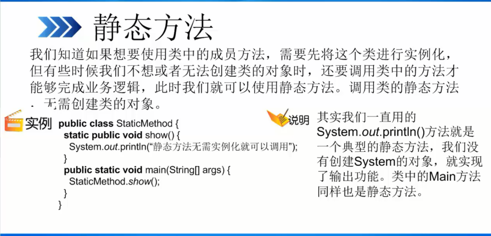
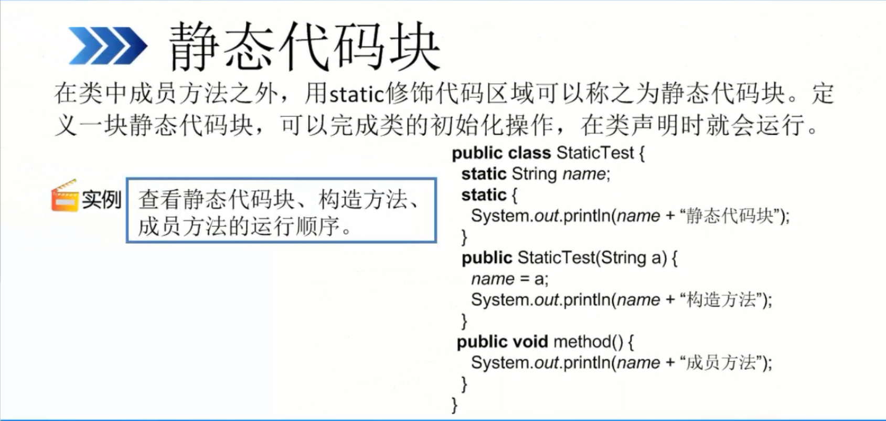

# 静态变量、常量和方法（static关键字）

``` 
public class Pool {
//	定义静态变量
	static public int water = 0;

//	定义进水的方法
	public void inlet() {
//		进水每次进3个单位
		water += 3;
	}

//	定义出水的方法
	public void outlet() {
		if (water >= 2) {
			water -= 2;
		} else {
			water = 2;
		}
	}

//	主方法
	public static void main(String[] args) {
//		实例化in进水类和出水类out
		Pool in = new Pool();
		Pool out = new Pool();
		
		System.out.println( "水池中的水量为: " + Pool.water);
		System.out.println("开始进水2次");
		in.inlet();
		in.inlet();
		System.out.println( "水池中的水量为: " + Pool.water);
		System.out.println("开始出水1次：");
		out.outlet();
		System.out.println( "水池中的水量为: " + Pool.water);
		
		
	}
}

/*
输出结果
水池中的水量为: 0
开始进水2次
水池中的水量为: 6
开始出水1次：
水池中的水量为: 4

*/
```


## 构造方法
``` 


public class staticVar {
//	静态变量
	static int x;
//	变量
	int y;

//	构造方法,对实例进行初始化传参
	public staticVar(int x, int y) {
		this.x = x;
		this.y = y;
		
	}
	public static void main(String[] args) {
		staticVar hu= new staticVar(1,2);
		System.out.println("x的值为："+hu.x);
		System.out.println("y的值为："+hu.y);
		
	}

}
/*输出
 * 结果
x的值为：1
y的值为：2

 */

```
## 静态变量
静态变量在实例和类中是共享的

```

public class staticVar {
//	静态变量
	static int x;
//	变量
	int y;

//	构造方法,对实例进行初始化传参
	public staticVar(int x, int y) {
		this.x = x;
		this.y = y;
		
	}
	public static void main(String[] args) {
		staticVar hu= new staticVar(1,2);
		staticVar hu2= new staticVar(94,722);
		System.out.println("x的值为："+hu.x);
		System.out.println("y的值为："+hu.y);
		
		System.out.println("x的值为："+hu2.x);
		System.out.println("y的值为："+hu2.y);
		
	}

}
/*输出
 * 结果
x的值为：94
y的值为：2
x的值为：94
y的值为：722
 */
```
## 静态常量
静态常量

用final 修饰一个成员变量， 这个成员变量就会变成一个静态常量。
所有类都要使用的常量，共享的

eg:
``` 

public class final_var {
//静态常量PI π。提供给圆和球共享使用
	final static double PI = 3.1415926;
	public static void main(String[] args) {
		Yuanxing hu = new Yuanxing(3.0);
		Qiuxing hu2 = new Qiuxing(3.0);

	}
	
}
	
	class Yuanxing {
//	圆的半径
		double radius;
//	圆的面积
		double area;

		public Yuanxing(double radius) {
			// 构造函数，圆的半径radius。
			this.radius = radius;

			area = final_var.PI * radius * radius;
			System.out.println("圆的半径是：" + radius);
			System.out.println("圆的面积是：" + area);

		}

	}

	class Qiuxing {
//	double型表示半径
		double radius;
//	球的体积
		double volume;

		public Qiuxing(double radius) {
			// 构造函数进行传参，radius为半径
			this.radius = radius;

			volume = 4 / 3 * final_var.PI * radius * radius * radius;
			System.out.println("球的半径为：" + radius);
			System.out.println("球的体积为：" + volume);
		}

	}
	


/*输出
 * 结果
圆的半径是：3.0
圆的面积是：28.274333400000003
球的半径为：3.0
球的体积为：84.82300020000001
*/


```

## 静态方法
静态方法不需要实例化，直接使用类名+方法名进行调用，和python类似


eg:
``` 

public class static_fangfa {
public static void show() {
	System.out.println("我是静态方法....");
	
}
public static void main(String[] args) {
	static_fangfa.show();
}
}

/*输出
 我是静态方法....
 */

```

## 静态代码块

eg:
``` 

public class jingtaidaimakuai {
static {
	System.out.println("这里是静态代码块.......");
	
}
{
	System.out.println("这里是非静态代码块......");
	}

public jingtaidaimakuai() {
	// TODO 自动生成的构造函数存根
	System.out.println("这里是构造方法......");

}

public void method() {
	System.out.println("这里是成员方法........");
	
}

public static void main(String[] args) {
	jingtaidaimakuai hu = new jingtaidaimakuai();
	hu.method();
}
}

/*输出信息
这里是静态代码块.......
这里是非静态代码块......
这里是构造方法......
这里是成员方法........
 */

```


