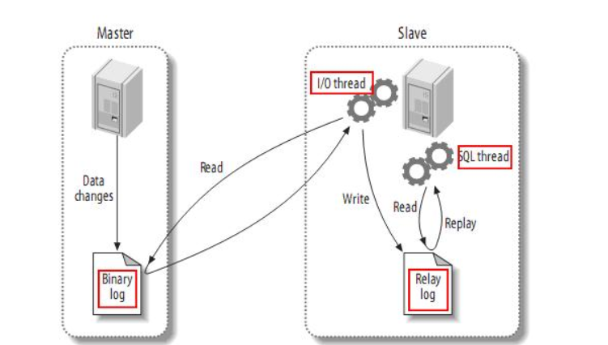

# MySQL 主从高可用架构

## MySQL 数据库主从复制原理
    Mysql 主从同步其实是一个异步复制的过程，要实现复制首先需要在 master 上开启
    bin-log 日志功能，
    整个过程需要开启 3 个线程，
    分别是 Master 开启 IO 线程，
    slave开启 IO 线程和 SQL 线程。
    

    

    MySQL 复制是从主服务器复制到一个或多个从服务器的异步过程，在主服务器与从服务器之间实现整个复制过程主要由三个线程来完成，其中一个I/O线程在主服务器端，另两个线程（SQL线程和IO线程）在从服务器端。
    要实现Mysql复制，首先要在主服务器上打开MySQL的Binary Log（产生二进制日志文件）功能，因为整个复制过程实际上就是从服务器从主服务器端获取该日志，然后在自身上将二进制文件解析为SQL语句并完全顺序地执行SQL语句所记录的各种操作。更详细的过程如下。
    1）首先从服务器上的I/O线程连接上主服务器，然后请求从指定日志文件的指定位置或者从最开始的日志位置之后的日志内容。
    2）主服务器在接收到来自从服务器的I/O线程请求后，通过自身的I/O线程，根据请求信息读取指定日志位置之后的日志信息，并返回给从服务器端的I/O线程。返回信息中除了日志所包含的信息之外，还包括此次返回的信息在主服务器端对应的二进制日志文件的名称以及在二进制日志中的位置。
    3）从服务器的I/O线程接收到信息后，将获取到的日志内容依次写入从服务器端的中继日志文件（类似于 mysql-relay-bin.xxxxxx）的最后，并且将读取到的主服务器端的二进制日志的文件名和位置记录到一个名为master-info文件中，以便在下一次读取的时候能够迅速定位从哪个位置开始往后读取日志信息。
    4）从服务器的SQL线程在检测到中继日志文件中新增加了内容后，会马上解析该中继日志文件中的内容，将日志内容解析为 SQL 语句，然后在自身执行这些 SQL，由于是在主服务器端和从服务器端执行了同样的SQL操作，所以两端的数据是完全一样的。至此整个复制过程结束

## MySQL复制的常用架构
MySQL复制技术在实际应用中有多种实现架构，常见的有以下几种。

    一主一从，即一个主服务器和一个从服务器。这是最常见的架构。
    一主多从，即一个主服务器和两个或两个以上从服务器。经常用在写操作不频繁、查询量比较大的业务环境中。
    主主互备，又称双主互备，即两个MySQL服务器互相将对方作为自己的主服务器，自己又同时作为对方的从服务器来进行复制。主要用于对 MySQL写操作要求比较高的环境中，避免了MySQL单点故障。
    双主多从，其实就是双主互备，然后再加上多个从服务器。主要用于对 MySQL写操作要求比较高，同时查询量比较大的环境中。这种构架在8.3节会详细介绍。
    其实可以根据具体的情况灵活地将主/从结构进行变化组合，但万变不离其宗，在进行MySQL复制的各种部署之前，有一些必须遵守的规则。
    同一时刻只能有一个主服务器进行写操作。
    一个主服务器可以有多个从服务器。
    无论是主服务器还是从服务器，都要确保各自的服务器 ID 唯一，不然，双主互备就会出问题。
    一个从服务器可以将其从主服务器获得的更新信息传递给其他的从服务器，依次类推。
    
https://blog.csdn.net/weixin_41846320/article/details/85064058

## MySQL 数据库主从配置
    环境：
        mysql主机：192.168.1.111  CentOS Linux release 7.5
        mysql备机：192.168.1.112  CentOS Linux release 7.5
        
## 主和从服务器都安装 mysql 相关软件

    1.安装依赖
    yum -y install autoconf libaio bison ncurses-devel
    
    2.创建用户
    groupadd mysql
    useradd -g mysql -s /sbin/nologin mysql
    
    3.清理centos7 默认自带数据库
    yum -y remove mariadb mariadb-server
    
    #下载包
    cd /usr/src/
    wget https://dev.mysql.com/get/Downloads/MySQL-5.7/mysql-5.7.21-linux-glibc2.12-x86_64.tar.gz
    tar -xf mysql-5.7.21-linux-glibc2.12-x86_64.tar.gz
    
    #移动过去，后面是存放路径
    mv mysql-5.7.21-linux-glibc2.12-x86_64 /usr/local/mysql
    mkdir /var/log/mysql
    mkdir /usr/local/mysql/data
    
    mysql即使root启动还是mysql用户运行的，所以要给权限
    chown -R mysql:mysql /usr/local/mysql
    chown -R mysql:mysql /var/log/mysql
    
添加新的my.cnf文件
vim /etc/my.cnf
    
    [client]
    port = 3306
    socket = /tmp/mysql.sock
    
    [mysqld]
    character_set_server=utf8
    init_connect='SET NAMES utf8'
    basedir=/usr/local/mysql
    datadir=/usr/local/mysql/data
    socket=/tmp/mysql.sock
    log-error=/var/log/mysqld.log
    pid-file=/usr/local/mysql/mysqld.pid
  
    
3.初始化
    
    chmod 777 /var/log/mysqld.log
    chown -R mysql:mysql /var/log/mysqld.log
    cd /usr/local/mysql/bin
    初始化数据库，没有反应则正确
    /usr/local/mysql/bin/mysqld --initialize --user=mysql --basedir=/usr/local/mysql --datadir=/usr/local/mysql/data --lc_messages_dir=/usr/local/mysql/share --lc_messages=en_US
    
    #加入systemctl
    vim /usr/lib/systemd/system/mysql.service
    
    [Unit]
    Description=mysql
    After=network.target remote-fs.target nss-lookup.target
    
    [Service]
    Type=forking
    ExecStart=/usr/local/mysql/support-files/mysql.server start
    ExecReload=/usr/local/mysql/support-files/mysql.server restart
    ExecStop=/usr/local/mysql/support-files/mysql.server stop
    PrivateTmp=true
    
    [Install]
    WantedBy=multi-user.target
    5.设置环境变量
    echo 'PATH=$PATH':/usr/local/mysql/bin >> /etc/profile
    source /etc/profile
    
    #启动
    systemctl daemon-reload
    systemctl start mysql
    systemctl enable mysql
    
    
    #查看密码
    cat /var/log/mysqld.log
    最后一行：root@localhost: 这里就是初始密码
    
    #修改mysql的登录密码
    service mysqld stop
    
    #使用 mysqld_safe 来启动mysql服务
    [root@CentOS ~]# cd /usr/local/mysql/bin/
    [root@CentOS bin]# ./mysqld_safe --skip-grant-tables &
    
    mysql -uroot mysql
    修改MySQL密码方式：

			首先执行：update user set authentication_string=password('123abc') where user='root';	
			然后执行：ALTER USER 'root'@'localhost' IDENTIFIED WITH mysql_native_password BY '新密码';
			
			#mysql-8.0.11-winx64初次修改密码
			ALTER USER root@localhost IDENTIFIED  BY '123456';
			
			
    
## 配置主从

主数据库操作

    1.开启binlog
    
    [mysqld]
    log-bin=mysql-bin #开启二进制日志
    server-id=1 #设置server-id，和从不能一样
    
    2.重启mysql，创建用于同步的用户账号
    service mysqld restart
    
    [root@nginx_keepalived_master mysql]# mysql -uroot -padmin#123!
    
    创建用户并授权：用户：test密码：123456，ip修改为从的ip
    CREATE USER 'test'@'123.57.44.85' IDENTIFIED BY '123456';
    
    分配中权限
    GRANT REPLICATION SLAVE ON *.* TO 'test'@'123.57.44.85';
    flush privileges;
    
    锁表，禁止写入，当前窗口不能退出，这时候开启另一个终端继续操作
    flush table with read lock;
    
    3.新窗口操作，查看master状态，记录二进制文件名(mysql-bin.000003)和位置(73)：
    
    SHOW MASTER STATUS;
    
    mysql> show master status;
    +------------------+----------+--------------+------------------+-------------------+
    | File             | Position | Binlog_Do_DB | Binlog_Ignore_DB | Executed_Gtid_Set |
    +------------------+----------+--------------+------------------+-------------------+
    | mysql-bin.000001 |     1165 |              |                  |                   |
    +------------------+----------+--------------+------------------+-------------------+
    1 row in set (0.00 sec)

    mysqldump -uroot -padmin#123! --all-databases >/root/alldb.sql

     ll /root/alldb.sql 
    -rw-r--r--. 1 root root 785545 2月  17 20:33 /root/alldb.sql
    

    解锁查看binlog日志位置，如果没变证明锁定成功。从库将从这个binlog日志开始恢复
    unlock table;

    #将主库的数据拷贝到备机
    scp alldb.sql root@192.168.1.112:/root/
    
    
从数据库操作

    1.导入数据
    mysql -uroot -padmin#123! < /root/alldb.sql
    
    2.修改配置文件
    vim /etc/my.cnf
    
    [mysqld]
    server-id=2 #设置server-id，必须唯一
    3.重启mysql，配置同步
    
    需要主服务器主机名，登陆凭据，二进制文件的名称和位置
    mysql> CHANGE MASTER TO MASTER_HOST='192.168.1.111',
        -> MASTER_USER='test', MASTER_PASSWORD='123456', 
        -> MASTER_LOG_FILE='mysql-bin.000001',MASTER_LOG_POS=2246;
    
    start slave;

查看slave状态：

    show slave status\G;
    mysql> show slave status\G;
    *************************** 1. row ***************************
                   Slave_IO_State: Waiting for master to send event
                      Master_Host: 192.168.1.111
                      Master_User: test
                      Master_Port: 3306
                    Connect_Retry: 60
                  Master_Log_File: mysql-bin.000001
              Read_Master_Log_Pos: 2594
                   Relay_Log_File: nginx_keepalived_backup-relay-bin.000002
                    Relay_Log_Pos: 668
            Relay_Master_Log_File: mysql-bin.000001
                 Slave_IO_Running: Yes
                Slave_SQL_Running: Yes
                  Replicate_Do_DB: 
              Replicate_Ignore_DB: 
               Replicate_Do_Table: 
           Replicate_Ignore_Table: 
          Replicate_Wild_Do_Table: 
      Replicate_Wild_Ignore_Table: 
                       Last_Errno: 0
                       Last_Error: 
                     Skip_Counter: 0
              Exec_Master_Log_Pos: 2594
                  Relay_Log_Space: 893
                  Until_Condition: None
                   Until_Log_File: 
                    Until_Log_Pos: 0
               Master_SSL_Allowed: No
               Master_SSL_CA_File: 
               Master_SSL_CA_Path: 
                  Master_SSL_Cert: 
                Master_SSL_Cipher: 
                   Master_SSL_Key: 
            Seconds_Behind_Master: 0
    Master_SSL_Verify_Server_Cert: No
                    Last_IO_Errno: 0
                    Last_IO_Error: 
                   Last_SQL_Errno: 0
                   Last_SQL_Error: 
      Replicate_Ignore_Server_Ids: 
                 Master_Server_Id: 1
                      Master_UUID: 750a3dc6-32a6-11e9-8c2e-000c29449e0f
                 Master_Info_File: /usr/local/mysql/data/master.info
                        SQL_Delay: 0
              SQL_Remaining_Delay: NULL
          Slave_SQL_Running_State: Slave has read all relay log; waiting for more updates
               Master_Retry_Count: 86400
                      Master_Bind: 
          Last_IO_Error_Timestamp: 
         Last_SQL_Error_Timestamp: 
                   Master_SSL_Crl: 
               Master_SSL_Crlpath: 
               Retrieved_Gtid_Set: 
                Executed_Gtid_Set: 
                    Auto_Position: 0
             Replicate_Rewrite_DB: 
                     Channel_Name: 
               Master_TLS_Version: 
    1 row in set (0.00 sec)
    
    ERROR: 
    No query specified
 
## 测试主从同步
    在主库上创建2个数据库
    create database bolg default character set utf8;
    create database bolg2 default character set utf8;

    在从库上查看，发现已经同步到数据。
