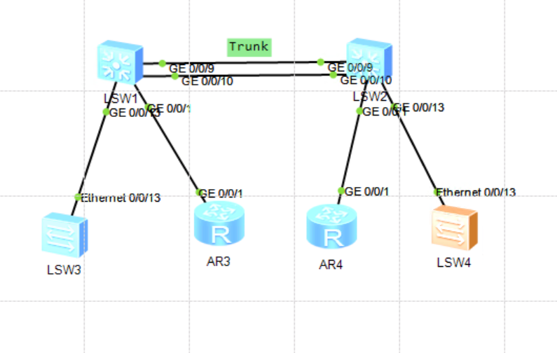
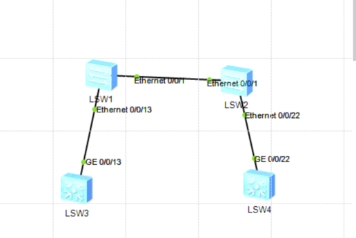
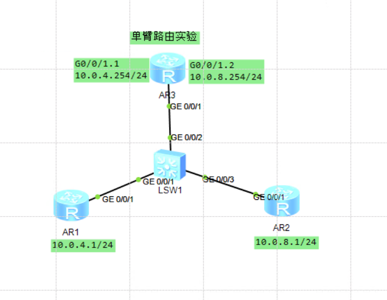
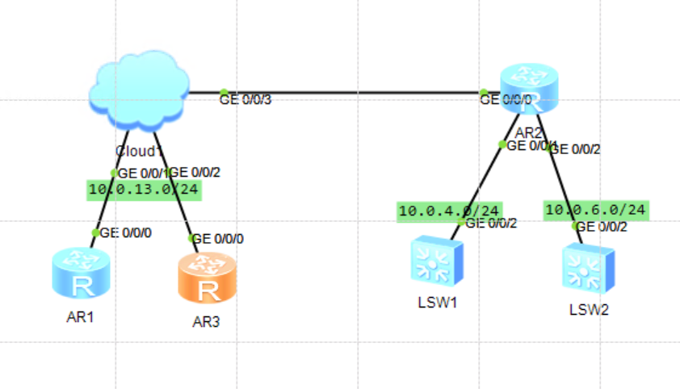

# HCNA实验
__以太网与VLAN__

## 1.1 以太网接口和配置
1.掌握接口速率和双工模式的配置方法

2.掌握实验手段模式配置链路聚合的方法

3.掌握实验静态LACP模式配置链路聚合的方法

#### 拓扑图：


### 1.配置手工模式的链路聚合（关闭自协商、接口速率为100,，全双工）
* 方式一
```
[sw1]interface Eth-Trunk 1
[sw1]interface GigabitEthernet 0/0/9
[sw1-GigabitEthernet0/0/9]eth-trunk 1
```
* 方式二
```
#创建Eth-Trunk 1，将接口0/0/9 - 0/0/10一次加入Eth-Trunk 1中
[sw1]interface Eth-Trunk 1
[sw1-Eth-Trunk1]trunkport GigabitEthernet 0/0/9 to 0/0/10

interface GigabitEthernet0/0/9
 undo negotiation auto
 speed 100
 eth-trunk 1
#
interface GigabitEthernet0/0/10
 undo negotiation auto
 speed 100
 eth-trunk 1
```
* 查看Eth-trunk的配置结果
```
[sw1]display eth-trunk 1
Eth-Trunk1's state information is:
WorkingMode: NORMAL         Hash arithmetic: According to SIP-XOR-DIP
Least Active-linknumber: 1  Max Bandwidth-affected-linknumber: 8
Operate status: up          Number Of Up Port In Trunk: 2
--------------------------------------------------------------------------------
PortName                      Status      Weight
GigabitEthernet0/0/9          Up          1
GigabitEthernet0/0/10         Up          1


[sw2]display eth-trunk 1
Eth-Trunk1's state information is:
WorkingMode: NORMAL         Hash arithmetic: According to SIP-XOR-DIP
Least Active-linknumber: 1  Max Bandwidth-affected-linknumber: 8
Operate status: up          Number Of Up Port In Trunk: 2
--------------------------------------------------------------------------------
PortName                      Status      Weight
GigabitEthernet0/0/9          Up          1
GigabitEthernet0/0/10         Up          1
```

### 配置静态LACP
* 配置文件如下：
```
[SW1]display current-configuration
#
sysname SW1
#
lacp priority 100   #设置SW1为LACP主动端

interface Vlanif1

#
interface Eth-Trunk1
 mode lacp-static

#
interface GigabitEthernet0/0/9
 undo negotiation auto
 speed 100
 eth-trunk 1
 lacp priority 100   #配置接口优先级确定活动链路
#
interface GigabitEthernet0/0/10
 undo negotiation auto
 speed 100
 eth-trunk 1
 lacp priority 100   #配置接口优先级确定活动链路
```
```
[SW2]display current-configuration
#
sysname SW2

interface GigabitEthernet0/0/9
 undo negotiation auto
 speed 100
 eth-trunk 1
#
interface GigabitEthernet0/0/10
 undo negotiation auto
 speed 100
 eth-trunk 1
```

* 查看Eth-trunk的配置结果
```
[SW1]display eth-trunk 1
Eth-Trunk1's state information is:
Local:
LAG ID: 1                   WorkingMode: STATIC
Preempt Delay: Disabled     Hash arithmetic: According to SIP-XOR-DIP
System Priority: 100        System ID: 4c1f-ccf3-0486
Least Active-linknumber: 1  Max Active-linknumber: 8
Operate status: up          Number Of Up Port In Trunk: 2
--------------------------------------------------------------------------------
ActorPortName          Status   PortType PortPri PortNo PortKey PortState Weight
GigabitEthernet0/0/9   Selected 1GE      100     10     305     10111100  1
GigabitEthernet0/0/10  Selected 1GE      100     11     305     10111100  1

Partner:
--------------------------------------------------------------------------------
ActorPortName          SysPri   SystemID        PortPri PortNo PortKey PortState
GigabitEthernet0/0/9   32768    4c1f-ccaa-681d  32768   10     305     10111100
GigabitEthernet0/0/10  32768    4c1f-ccaa-681d  32768   11     305     10111100
```
```
[SW2]display eth-trunk 1
Eth-Trunk1's state information is:
Local:
LAG ID: 1                   WorkingMode: STATIC
Preempt Delay: Disabled     Hash arithmetic: According to SIP-XOR-DIP
System Priority: 32768      System ID: 4c1f-ccaa-681d
Least Active-linknumber: 1  Max Active-linknumber: 8
Operate status: up          Number Of Up Port In Trunk: 2
--------------------------------------------------------------------------------
ActorPortName          Status   PortType PortPri PortNo PortKey PortState Weight
GigabitEthernet0/0/9   Selected 1GE      32768   10     305     10111100  1
GigabitEthernet0/0/10  Selected 1GE      32768   11     305     10111100  1

Partner:
--------------------------------------------------------------------------------
ActorPortName          SysPri   SystemID        PortPri PortNo PortKey PortState
GigabitEthernet0/0/9   100      4c1f-ccf3-0486  100     10     305     10111100
GigabitEthernet0/0/10  100      4c1f-ccf3-0486  100     11     305     10111100
```
## 1.2 VLAN配置
1.掌握vlan的创建方法
2.掌握Access和Trunk类型接口的配置方法
3.掌握Hybird接口的配置
4.掌握将接口与VLAN关联的配置方法

#### 拓扑图如下：


### 配置文件
- SW1
```
[SW1]display current-configuration
#
sysname SW1
#
vlan batch 3 to 4
#
lacp priority 100

interface Eth-Trunk1
 port link-type trunk
 port trunk allow-pass vlan 2 to 4094
 mode lacp-static
#
interface GigabitEthernet0/0/1
 port link-type access
 port default vlan 4

interface GigabitEthernet0/0/9
 undo negotiation auto
 speed 100
 eth-trunk 1
 lacp priority 100
#
interface GigabitEthernet0/0/10
 undo negotiation auto
 speed 100
 eth-trunk 1
 lacp priority 100

interface GigabitEthernet0/0/13
 port link-type access
 port default vlan 3
```

- SW2
```
[SW2]display current-configuration
#
sysname SW2
#
vlan batch 2 4

interface Eth-Trunk1
 port link-type trunk
 port trunk allow-pass vlan 2 to 4094
 mode lacp-static
#
interface GigabitEthernet0/0/1
 port link-type access
 port default vlan 4

interface GigabitEthernet0/0/9
 undo negotiation auto
 speed 100
 eth-trunk 1
#
interface GigabitEthernet0/0/10
 undo negotiation auto
 speed 100
 eth-trunk 1

interface GigabitEthernet0/0/13
 port link-type access
 port default vlan 2
```
- SW3
```
[sw3]dis current-configuration
#
sysname sw3

interface Vlanif1
 ip address 10.0.4.2 255.255.255.0

```
- SW4
```
[Huawei]display current-configuration
#
sysname Huawei

interface Vlanif1
 ip address 10.0.4.4 255.255.255.0
```
- R3
```
interface GigabitEthernet0/0/1
 ip address 10.0.4.1 255.255.255.0
```

- R4
```
interface GigabitEthernet0/0/1
 ip address 10.0.4.3 255.255.255.0
```

R3和R4在同一vlan，可以互通，如下：
```
[R4-GigabitEthernet0/0/1]ping 10.0.4.1
  PING 10.0.4.1: 56  data bytes, press CTRL_C to break
    Reply from 10.0.4.1: bytes=56 Sequence=1 ttl=255 time=110 ms
    Reply from 10.0.4.1: bytes=56 Sequence=2 ttl=255 time=70 ms

[R3]ping 10.0.4.3
  PING 10.0.4.3: 56  data bytes, press CTRL_C to break
    Reply from 10.0.4.3: bytes=56 Sequence=1 ttl=255 time=80 ms
    Reply from 10.0.4.3: bytes=56 Sequence=2 ttl=255 time=70 ms
```


- SW1
```
[SW1]display current-configuration
#
sysname SW1
#
vlan batch 2 to 4

interface Eth-Trunk1
 port link-type trunk
 port trunk allow-pass vlan 2 to 4094
 mode lacp-static
                        #
                        interface GigabitEthernet0/0/1
                         port hybrid pvid vlan 4
                         port hybrid untagged vlan 2 4

interface GigabitEthernet0/0/9
 undo negotiation auto
 speed 100
 eth-trunk 1
 lacp priority 100
#
interface GigabitEthernet0/0/10
 undo negotiation auto
 speed 100
 eth-trunk 1
 lacp priority 100

interface GigabitEthernet0/0/13
 port link-type access
 port default vlan 3
```

- SW2
```
[SW2]display current-configuration
#
sysname SW2
#
vlan batch 2 4
#
interface Eth-Trunk1
 port link-type trunk
 port trunk allow-pass vlan 2 to 4094
 mode lacp-static
                    #
                    interface GigabitEthernet0/0/1
                     port hybrid pvid vlan 4
                     port hybrid untagged vlan 2 4

interface GigabitEthernet0/0/9
 undo negotiation auto
 speed 100
 eth-trunk 1
#
interface GigabitEthernet0/0/10
 undo negotiation auto
 speed 100
 eth-trunk 1

#
                    interface GigabitEthernet0/0/13
                     port hybrid pvid vlan 2
                     port hybrid untagged vlan 2 4

```

- 实现效果; R3、R4、SW4之间互通，Vlan2和Vlan4打通通信

## 1.3 GVRP配置
* 掌握GVRP的配置方法
* 掌握GVRP不同注册模式的配置方法

#### 拓扑图


### 配置如下
- sw1
```
[Sw1]display current-configuration
#
sysname Sw1
#
vlan batch 2
#
gvrp

#
interface Ethernet0/0/1
 port link-type trunk
 port trunk allow-pass vlan 2 to 4094
 gvrp

interface Ethernet0/0/13
 port link-type trunk
 port trunk allow-pass vlan 2 to 4094
 gvrp
```
- sw1查看学习到的vlan
```
[Sw1]display  vlan
Dec 21 2018 15:24:05-08:00 Sw1 DS/4/DATASYNC_CFGCHANGE:OID 1.3.6.1.4.1.2011.5.25
.191.3.1 configurations have been changed. The current change number is 20, the
change loop count is 0, and the maximum number of records is 4095. vlan
The total number of vlans is : 4
--------------------------------------------------------------------------------
U: Up;         D: Down;         TG: Tagged;         UT: Untagged;
MP: Vlan-mapping;               ST: Vlan-stacking;
#: ProtocolTransparent-vlan;    *: Management-vlan;
--------------------------------------------------------------------------------

VID  Type    Ports
--------------------------------------------------------------------------------
1    common  UT:Eth0/0/1(U)     Eth0/0/2(D)     Eth0/0/3(D)     Eth0/0/4(D)
                Eth0/0/5(D)     Eth0/0/6(D)     Eth0/0/7(D)     Eth0/0/8(D)
                Eth0/0/9(D)     Eth0/0/10(D)    Eth0/0/11(D)    Eth0/0/12(D)
                Eth0/0/13(U)    Eth0/0/14(D)    Eth0/0/15(D)    Eth0/0/16(D)
                Eth0/0/17(D)    Eth0/0/18(D)    Eth0/0/19(D)    Eth0/0/20(D)
                Eth0/0/21(D)    Eth0/0/22(D)    GE0/0/1(D)      GE0/0/2(D)

2    common  TG:Eth0/0/1(U)     Eth0/0/13(U)

100  dynamic TG:Eth0/0/1(U)     Eth0/0/13(U)

200  dynamic TG:Eth0/0/1(U)     Eth0/0/13(U)


VID  Status  Property      MAC-LRN Statistics Description
--------------------------------------------------------------------------------

1    enable  default       enable  disable    VLAN 0001
2    enable  default       enable  disable    VLAN 0002

100  enable  default       enable  disable    VLAN 0100
200  enable  default       enable  disable    VLAN 0200

```

- sw 2 配置
```
[SW2]display current-configuration
#
sysname SW2
#
vlan batch 2
#
gvrp

interface Ethernet0/0/1
 port link-type trunk
 port trunk allow-pass vlan 2 to 4094
 gvrp

interface Ethernet0/0/22
 port link-type trunk
 port trunk allow-pass vlan 2 to 4094
 gvrp

```

- 查看sw2 学习到的vlan
```
[SW2]display vlan
The total number of vlans is : 4
--------------------------------------------------------------------------------
U: Up;         D: Down;         TG: Tagged;         UT: Untagged;
MP: Vlan-mapping;               ST: Vlan-stacking;
#: ProtocolTransparent-vlan;    *: Management-vlan;
--------------------------------------------------------------------------------

VID  Type    Ports
--------------------------------------------------------------------------------
1    common  UT:Eth0/0/1(U)     Eth0/0/2(D)     Eth0/0/3(D)     Eth0/0/4(D)
                Eth0/0/5(D)     Eth0/0/6(D)     Eth0/0/7(D)     Eth0/0/8(D)
                Eth0/0/9(D)     Eth0/0/10(D)    Eth0/0/11(D)    Eth0/0/12(D)
                Eth0/0/13(D)    Eth0/0/14(D)    Eth0/0/15(D)    Eth0/0/16(D)
                Eth0/0/17(D)    Eth0/0/18(D)    Eth0/0/19(D)    Eth0/0/20(D)
                Eth0/0/21(D)    Eth0/0/22(U)    GE0/0/1(D)      GE0/0/2(D)

2    common  TG:Eth0/0/1(U)     Eth0/0/22(U)

100  dynamic TG:Eth0/0/1(U)     Eth0/0/22(U)

200  dynamic TG:Eth0/0/1(U)     Eth0/0/22(U)


VID  Status  Property      MAC-LRN Statistics Description
--------------------------------------------------------------------------------

1    enable  default       enable  disable    VLAN 0001
2    enable  default       enable  disable    VLAN 0002
100  enable  default       enable  disable    VLAN 0100
200  enable  default       enable  disable    VLAN 0200
```

- sw3配置
```
[SW3]display current-configuration
#
sysname SW3
#
vlan batch 2 100 200
#
gvrp

interface GigabitEthernet0/0/13
 port link-type trunk
 port trunk allow-pass vlan 2 to 4094
 gvrp

```

- sw4配置
```
[SW4]displa cu
#
sysname SW4
#
vlan batch 2 100 200
#
gvrp

interface GigabitEthernet0/0/22
 port link-type trunk
 port trunk allow-pass vlan 2 to 4094
 gvrp
```

需要手动的设置vlan
SW3：vlan 100
SW4：vlan 200

使得sw1和sw2交换机两端都能动态的学习到vlan信息，这样报文就能够双向通信

#### 修改交换机接口的注册模式
* sw1
```
[SW2-Ethernet0/0/1]gvrp registration fixed


[Sw1]display gvrp statistics
  GVRP statistics on port Ethernet0/0/1
    GVRP status				: Enabled
    GVRP registrations failed		: 45
    GVRP last PDU origin		: 4c1f-cc40-0f86
    GVRP registration type		: Fixed

  GVRP statistics on port Ethernet0/0/13
    GVRP status				: Enabled
    GVRP registrations failed		: 0
    GVRP last PDU origin		: 4c1f-ccbe-3f53
    GVRP registration type		: Normal


[Sw1]display vlan
The total number of vlans is : 4
--------------------------------------------------------------------------------
U: Up;         D: Down;         TG: Tagged;         UT: Untagged;
MP: Vlan-mapping;               ST: Vlan-stacking;
#: ProtocolTransparent-vlan;    *: Management-vlan;
--------------------------------------------------------------------------------

VID  Type    Ports
--------------------------------------------------------------------------------
1    common  UT:Eth0/0/1(U)     Eth0/0/2(D)     Eth0/0/3(D)     Eth0/0/4(D)
                Eth0/0/5(D)     Eth0/0/6(D)     Eth0/0/7(D)     Eth0/0/8(D)
                Eth0/0/9(D)     Eth0/0/10(D)    Eth0/0/11(D)    Eth0/0/12(D)
                Eth0/0/13(U)    Eth0/0/14(D)    Eth0/0/15(D)    Eth0/0/16(D)
                Eth0/0/17(D)    Eth0/0/18(D)    Eth0/0/19(D)    Eth0/0/20(D)
                Eth0/0/21(D)    Eth0/0/22(D)    GE0/0/1(D)      GE0/0/2(D)


2    common  TG:Eth0/0/1(U)     Eth0/0/13(U)


100  dynamic TG:Eth0/0/13(U)
200  dynamic TG:Eth0/0/13(U)


```
* sw2
```
[SW2-Ethernet0/0/1]gvrp registration fixed


[SW2]display gvrp statistics

  GVRP statistics on port Ethernet0/0/1
    GVRP status				: Enabled
    GVRP registrations failed		: 2
    GVRP last PDU origin		: 4c1f-cce9-6d23
    GVRP registration type		: Fixed

  GVRP statistics on port Ethernet0/0/22
    GVRP status				: Enabled
    GVRP registrations failed		: 0
    GVRP last PDU origin		: 4c1f-ccac-22b1
    GVRP registration type		: Normal


[SW2]display vlan
The total number of vlans is : 4
--------------------------------------------------------------------------------
U: Up;         D: Down;         TG: Tagged;         UT: Untagged;
MP: Vlan-mapping;               ST: Vlan-stacking;
#: ProtocolTransparent-vlan;    *: Management-vlan;
--------------------------------------------------------------------------------

VID  Type    Ports
--------------------------------------------------------------------------------
1    common  UT:Eth0/0/1(U)     Eth0/0/2(D)     Eth0/0/3(D)     Eth0/0/4(D)
                Eth0/0/5(D)     Eth0/0/6(D)     Eth0/0/7(D)     Eth0/0/8(D)
                Eth0/0/9(D)     Eth0/0/10(D)    Eth0/0/11(D)    Eth0/0/12(D)
                Eth0/0/13(D)    Eth0/0/14(D)    Eth0/0/15(D)    Eth0/0/16(D)
                Eth0/0/17(D)    Eth0/0/18(D)    Eth0/0/19(D)    Eth0/0/20(D)
                Eth0/0/21(D)    Eth0/0/22(U)    GE0/0/1(D)      GE0/0/2(D)

2    common  TG:Eth0/0/1(U)     Eth0/0/22(U)


100  dynamic TG:Eth0/0/22(U)
200  dynamic TG:Eth0/0/22(U)
```
__回显信息中灰色阴影标注的部分表明端口E0/0/1无法注册动态VLAN100和200__

##### 配置S1、S2 E0/0/1接口的注册模式为Forbidden

- sw1
```
[Sw1-Ethernet0/0/1]gvrp registration forbidden
Info: This operation may take a few seconds. Please wait for a moment...done.

[Sw1]display gvrp statistics

  GVRP statistics on port Ethernet0/0/1
    GVRP status				: Enabled
    GVRP registrations failed		: 87
    GVRP last PDU origin		: 4c1f-cc40-0f86
    GVRP registration type		: Forbidden

  GVRP statistics on port Ethernet0/0/13
    GVRP status				: Enabled
    GVRP registrations failed		: 0
    GVRP last PDU origin		: 4c1f-ccbe-3f53
    GVRP registration type		: Normal

[Sw1]display vlan
The total number of vlans is : 4
--------------------------------------------------------------------------------
U: Up;         D: Down;         TG: Tagged;         UT: Untagged;
MP: Vlan-mapping;               ST: Vlan-stacking;
#: ProtocolTransparent-vlan;    *: Management-vlan;
--------------------------------------------------------------------------------

VID  Type    Ports
--------------------------------------------------------------------------------
1    common  UT:Eth0/0/1(U)     Eth0/0/2(D)     Eth0/0/3(D)     Eth0/0/4(D)
                Eth0/0/5(D)     Eth0/0/6(D)     Eth0/0/7(D)     Eth0/0/8(D)
                Eth0/0/9(D)     Eth0/0/10(D)    Eth0/0/11(D)    Eth0/0/12(D)

                Eth0/0/13(U)    Eth0/0/14(D)    Eth0/0/15(D)    Eth0/0/16(D)
                Eth0/0/17(D)    Eth0/0/18(D)    Eth0/0/19(D)    Eth0/0/20(D)
                Eth0/0/21(D)    Eth0/0/22(D)    GE0/0/1(D)      GE0/0/2(D)
2    common  TG:Eth0/0/13(U)

100  dynamic TG:Eth0/0/13(U)
200  dynamic TG:Eth0/0/13(U)
```

- sw2

```
[SW2-Ethernet0/0/1]gvrp registration forbidden

[SW2]display gvrp statistics

  GVRP statistics on port Ethernet0/0/1
    GVRP status				: Enabled
    GVRP registrations failed		: 63
    GVRP last PDU origin		: 4c1f-cce9-6d23
    GVRP registration type		: Forbidden

  GVRP statistics on port Ethernet0/0/22
    GVRP status				: Enabled
    GVRP registrations failed		: 0
    GVRP last PDU origin		: 4c1f-ccac-22b1
    GVRP registration type		: Normal

[SW2]display vlan
The total number of vlans is : 4
--------------------------------------------------------------------------------
U: Up;         D: Down;         TG: Tagged;         UT: Untagged;
MP: Vlan-mapping;               ST: Vlan-stacking;
#: ProtocolTransparent-vlan;    *: Management-vlan;
--------------------------------------------------------------------------------

VID  Type    Ports
--------------------------------------------------------------------------------
1    common  UT:Eth0/0/1(U)     Eth0/0/2(D)     Eth0/0/3(D)     Eth0/0/4(D)
                Eth0/0/5(D)     Eth0/0/6(D)     Eth0/0/7(D)     Eth0/0/8(D)
                Eth0/0/9(D)     Eth0/0/10(D)    Eth0/0/11(D)    Eth0/0/12(D)
                Eth0/0/13(D)    Eth0/0/14(D)    Eth0/0/15(D)    Eth0/0/16(D)
                Eth0/0/17(D)    Eth0/0/18(D)    Eth0/0/19(D)    Eth0/0/20(D)
                Eth0/0/21(D)    Eth0/0/22(U)    GE0/0/1(D)      GE0/0/2(D)

2    common  TG:Eth0/0/22(U)

100  dynamic TG:Eth0/0/22(U)
200  dynamic TG:Eth0/0/22(U)
```
* 在 Forbidden模式下E0/0/1接口只允许VLAN1的报文通过，禁止任何其他VLAN的报文通过

## 1.4 VLAN间路由
### 掌握知识
 - 1 掌握用于VLAN间路由的Trunk接口的配置方法
 - 2 掌握单个物理接口上配置多个子接口的方法
 - 3 掌握VLAN间实现ARP通信的配置方法

#### 单臂路由
#### 网络拓扑图如下：


- R1配置
```
[R1]display current-configuration
[V200R003C00]
#
 sysname R1

interface GigabitEthernet0/0/1
 ip address 10.0.4.1 255.255.255.0

ip route-static 0.0.0.0 0.0.0.0 10.0.4.254
```
- R2配置
```
[R2]display current-configuration
[V200R003C00]
#
 sysname R2
#
interface GigabitEthernet0/0/1
 ip address 10.0.8.1 255.255.255.0
#

ip route-static 0.0.0.0 0.0.0.0 10.0.8.254
```
- R3配置
```
[R3]display current-configuration
[V200R003C00]
#
 sysname R3
interface GigabitEthernet0/0/1.1
 dot1q termination vid 4
 ip address 10.0.4.254 255.255.255.0
 arp broadcast enable
#
interface GigabitEthernet0/0/1.2
 dot1q termination vid 8
 ip address 10.0.8.254 255.255.255.0
 arp broadcast enable

#查看路由条目
[R3]display ip routing-table
Route Flags: R - relay, D - download to fib
------------------------------------------------------------------------------
Routing Tables: Public
         Destinations : 10       Routes : 10

Destination/Mask    Proto   Pre  Cost      Flags NextHop         Interface

       10.0.4.0/24  Direct  0    0           D   10.0.4.254      GigabitEthernet0/0/1.1
     10.0.4.254/32  Direct  0    0           D   127.0.0.1       GigabitEthernet0/0/1.1
     10.0.4.255/32  Direct  0    0           D   127.0.0.1       GigabitEthernet0/0/1.1
       10.0.8.0/24  Direct  0    0           D   10.0.8.254      GigabitEthernet0/0/1.2
     10.0.8.254/32  Direct  0    0           D   127.0.0.1       GigabitEthernet0/0/1.2
     10.0.8.255/32  Direct  0    0           D   127.0.0.1       GigabitEthernet0/0/1.2
      127.0.0.0/8   Direct  0    0           D   127.0.0.1       InLoopBack0
      127.0.0.1/32  Direct  0    0           D   127.0.0.1       InLoopBack0
127.255.255.255/32  Direct  0    0           D   127.0.0.1       InLoopBack0
255.255.255.255/32  Direct  0    0           D   127.0.0.1       InLoopBack0
```
- SW配置
```
[SW1]display current-configuration
#
sysname SW1
#
vlan batch 4 8

interface GigabitEthernet0/0/1
 port link-type access
 port default vlan 4
#
interface GigabitEthernet0/0/2
 port link-type trunk
 port trunk allow-pass vlan 4 8
#
interface GigabitEthernet0/0/3
 port link-type access
 port default vlan 8
```
- vlan4和vlan8之间可以互通


#### 配置三层交换
* 掌握三层交换机实现VLAN通信的方法
* 通过Trunk链路实现VLAN间通信的配置方法
* 配置不同VLAN间动态路由协议OSPF的方法

#### 网络拓扑图如下：


- SW1
```
[sw1-ospf-1]display current-configuration
#
sysname sw1
#
vlan batch 3 to 7

interface Vlanif3
 ip address 10.0.3.254 255.255.255.0
#
interface Vlanif4
 ip address 10.0.4.254 255.255.255.0
#
interface Vlanif5
 ip address 10.0.5.1 255.255.255.0


interface Eth-Trunk1
 port link-type trunk
 port trunk allow-pass vlan 2 to 4094
#
interface GigabitEthernet0/0/1
 port link-type access
 port default vlan 4

interface GigabitEthernet0/0/9
 eth-trunk 1
#
interface GigabitEthernet0/0/10
 eth-trunk 1

interface GigabitEthernet0/0/13
 port link-type access
 port default vlan 3

ospf 1
 area 0.0.0.0
  network 10.0.0.0 0.255.255.255


 [sw1]display ip routing-table
Route Flags: R - relay, D - download to fib
------------------------------------------------------------------------------
Routing Tables: Public
         Destinations : 10       Routes : 10

Destination/Mask    Proto   Pre  Cost      Flags NextHop         Interface

       10.0.3.0/24  Direct  0    0           D   10.0.3.254      Vlanif3
     10.0.3.254/32  Direct  0    0           D   127.0.0.1       Vlanif3
       10.0.4.0/24  Direct  0    0           D   10.0.4.254      Vlanif4
     10.0.4.254/32  Direct  0    0           D   127.0.0.1       Vlanif4
       10.0.5.0/24  Direct  0    0           D   10.0.5.1        Vlanif5
       10.0.5.1/32  Direct  0    0           D   127.0.0.1       Vlanif5
       10.0.6.0/24  OSPF    10   2           D   10.0.5.2        Vlanif5
       10.0.7.0/24  OSPF    10   2           D   10.0.5.2        Vlanif5
      127.0.0.0/8   Direct  0    0           D   127.0.0.1       InLoopBack0
      127.0.0.1/32  Direct  0    0           D   127.0.0.1       InLoopBack0
```

- SW2
```
[SW2-ospf-1-area-0.0.0.0]display current-configuration
#
sysname SW2
#
vlan batch 3 to 7

interface Vlanif5
 ip address 10.0.5.2 255.255.255.0
#
interface Vlanif6
 ip address 10.0.6.254 255.255.255.0
#
interface Vlanif7
 ip address 10.0.7.254 255.255.255.0

interface GigabitEthernet0/0/3
 port link-type access
 port default vlan 6
#
i
interface GigabitEthernet0/0/9
 eth-trunk 1
#
interface GigabitEthernet0/0/10
 eth-trunk 1

interface GigabitEthernet0/0/12
 port link-type access
 port default vlan 7
#

 area 0.0.0.0
  network 10.0.0.0 0.255.255.255


  [SW2-GigabitEthernet0/0/3]display ip routing-table
Route Flags: R - relay, D - download to fib
------------------------------------------------------------------------------
Routing Tables: Public
         Destinations : 10       Routes : 10

Destination/Mask    Proto   Pre  Cost      Flags NextHop         Interface

       10.0.3.0/24  OSPF    10   2           D   10.0.5.1        Vlanif5
       10.0.4.0/24  OSPF    10   2           D   10.0.5.1        Vlanif5
       10.0.5.0/24  Direct  0    0           D   10.0.5.2        Vlanif5
       10.0.5.2/32  Direct  0    0           D   127.0.0.1       Vlanif5
       10.0.6.0/24  Direct  0    0           D   10.0.6.254      Vlanif6
     10.0.6.254/32  Direct  0    0           D   127.0.0.1       Vlanif6
       10.0.7.0/24  Direct  0    0           D   10.0.7.254      Vlanif7
     10.0.7.254/32  Direct  0    0           D   127.0.0.1       Vlanif7
      127.0.0.0/8   Direct  0    0           D   127.0.0.1       InLoopBack0
      127.0.0.1/32  Direct  0    0           D   127.0.0.1       InLoopBack0
```

- R1
```
[R1]display current-configuration
[V200R003C00]
#
 sysname R1

interface GigabitEthernet0/0/1
 ip address 10.0.4.1 255.255.255.0
#

#
ip route-static 0.0.0.0 0.0.0.0 10.0.4.254
```

- R2
```
[R2]display current-configuration
[V200R003C00]
#
 sysname R2

interface GigabitEthernet0/0/2
 ip address 10.0.6.1 255.255.255.0

ip route-static 0.0.0.0 0.0.0.0 10.0.6.254
```
- SW3
```
[SW3]display current-configuration
#
sysname SW3
interface Vlanif1
 ip address 10.0.3.1 255.255.255.0

ip route-static 0.0.0.0 0.0.0.0 10.0.3.254
```

- SW4
```
[SW4]display current-configuration
#
sysname SW4
interface Vlanif1
 ip address 10.0.7.1 255.255.255.0

ip route-static 0.0.0.0 0.0.0.0 10.0.7.254
```

## 1.5 IP安全配置(ACL)

### 配置ACL过滤企业数据
* 掌握高级ACL的配置方法
* 掌握ACL在接口下的应用方法



* R1
```
[R1]display current-configuration
[V200R003C00]
#
 sysname R1


interface GigabitEthernet0/0/0
 ip address 10.0.13.1 255.255.255.0

#
ospf 1
 area 0.0.0.0
  network 10.0.13.0 0.0.0.255
```
* R2
```
[R2]display current-configuration
[V200R003C00]
#
 sysname R2
#
 snmp-agent local-engineid 800007DB03000000000000
 snmp-agent
#
 clock timezone China-Standard-Time minus 08:00:00
#
portal local-server load portalpage.zip
#
 drop illegal-mac alarm
#
 set cpu-usage threshold 80 restore 75
#
acl number 3000
 rule 5 permit tcp source 10.0.13.1 0 destination 10.0.4.254 0 destination-port
eq telnet
 rule 10 permit tcp source 10.0.13.3 0 destination 10.0.6.254 0 destination-port
 range ftp-data ftp
 rule 15 deny ip
#
aaa
 authentication-scheme default
 authorization-scheme default
 accounting-scheme default
 domain default
 domain default_admin
 local-user admin password cipher %$%$K8m.Nt84DZ}e#<0`8bmE3Uw}%$%$
 local-user admin service-type http
#
firewall zone Local
 priority 15
#
interface GigabitEthernet0/0/0
 ip address 10.0.13.2 255.255.255.0
#
interface GigabitEthernet0/0/1
 ip address 10.0.4.2 255.255.255.0
#
interface GigabitEthernet0/0/2
 ip address 10.0.6.2 255.255.255.0
 traffic-filter inbound acl 3000
#
interface NULL0
#
ospf 1
 area 0.0.0.0
  network 10.0.4.0 0.0.0.255
  network 10.0.6.0 0.0.0.255
  network 10.0.13.0 0.0.0.255
#
user-interface con 0
 authentication-mode password
user-interface vty 0 4
user-interface vty 16 20

```
* R3
```
[R3]display current-configuration
[V200R003C00]
#
 sysname R3

aaa
 authentication-scheme default
 authorization-scheme default
 accounting-scheme default
 domain default
 domain default_admin
 local-user admin password cipher %$%$K8m.Nt84DZ}e#<0`8bmE3Uw}%$%$
 local-user admin service-type http
#
firewall zone Local
 priority 15
#
interface GigabitEthernet0/0/0
 ip address 10.0.13.3 255.255.255.0


ospf 1
 area 0.0.0.0
  network 10.0.13.0 0.0.0.255

```

* SW1  telnet服务器
```
<SW1>display current-configuration
#
sysname SW1
#
vlan batch 4


interface Vlanif4
 ip address 10.0.4.254 255.255.255.0

#
interface GigabitEthernet0/0/2
 port link-type trunk
 port trunk pvid vlan 4
 port trunk allow-pass vlan 2 to 4094

#
ip route-static 0.0.0.0 0.0.0.0 10.0.4.2
user-interface con 0
user-interface vty 0 4
 set authentication password cipher Zm~.C3k[ND`S/0Rb{DzNkSg#
```
* SW2  ftp服务器
```
[SW2]display current-configuration
#
sysname SW2
#
FTP server enable
#
vlan batch 6

aaa
 authentication-scheme default
 authorization-scheme default
 accounting-scheme default
 domain default
 domain default_admin
 local-user admin password simple admin
 local-user admin service-type http
 local-user huawei password cipher $K&%QCXM$NYNZPO3JBXBHA!!
 local-user huawei ftp-directory flash:
 local-user huawei service-type ftp

interface Vlanif6
 ip address 10.0.6.254 255.255.255.0

interface GigabitEthernet0/0/2
 port link-type trunk
 port trunk pvid vlan 6
 port trunk allow-pass vlan 2 to 4094

ip route-static 0.0.0.0 0.0.0.0 10.0.6.2
#
user-interface con 0
user-interface vty 0 4
```


__R1可以访问S1的telnet服务器__
__R2可以访问S2的ftp服务器__


