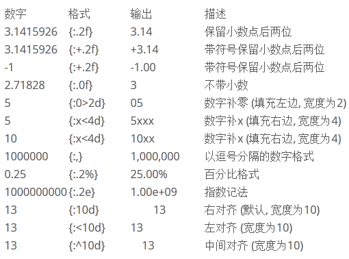

# 字符串数据类型


### 字符串内建方法

```

str='人生苦短'print(len(str.encode()))	#utf8每个中文占3个字节12print(len(str.encode("gbk")))	#gbk每个中文占2个字节8
string.expandtabs(tabsize=8)                  # tab符号转为空格 #默认8个空格
string.endswith(obj,beg=0,end=len(staring))   # 检测字符串是否已obj结束,如果是返回True #如果beg或end指定检测范围是否已obj结束
string.count(str,beg=0,end=len(string))       # 检测str在string里出现次数  f.count('\n',0,len(f)) 判断文件行数
string.find(str,beg=0,end=len(string))        # 检测str是否包含在string中
string.index(str,beg=0,end=len(string))       # 检测str不在string中,会报异常
string.isalnum()                              # 如果string至少有一个字符并且所有字符都是字母或数字则返回True
string.isalpha()                              # 如果string至少有一个字符并且所有字符都是字母则返回True
string.isnumeric()                            # 如果string只包含数字字符,则返回True
string.isspace()                              # 如果string包含空格则返回True	string.capitalize()							  #首字母小写转化为大写
string.isupper()                              # 字符串都是大写返回True
string.islower()                              # 字符串都是小写返回True
string.lower()                                # 转换字符串中所有大写为小写
string.upper()                                # 转换字符串中所有小写为大写
string.lstrip()                               # 去掉string左边的空格
string.rstrip()                               # 去掉string字符末尾的空格
string.replace(str1,str2,num=string.count(str1))  # 把string中的str1替换成str2,如果num指定,则替换不超过num次
string.startswith(obj,beg=0,end=len(string))  # 检测字符串是否以obj开头
string.zfill(width)                           # 返回字符长度为width的字符,原字符串右对齐,前面填充0
string.isdigit()                              # 只包含数字返回True
string.split("分隔符")                        # 把string切片成一个列表
":".join(string.split())                      # 以:作为分隔符,将所有元素合并为一个新的字符

```

### 字符串格式化
```python
#!/usr/bin/env python
#-*- coding:utf8 -*-
print("I am %s stduy %s" %("hujianli","python"))
print("I am {0} stduy {1}".format("hujianli","python") )
str = "I am {0} stduy {1}"
name = ("hujianli","python")
print(str.format(*name))

print("%d + %d = %d" % (2,3,2+3))
print("%d + %d = %d" % (3,7,3+7))


print(" 分割线 ".center(100,"*"))

template = '编号:%09d\t 公司名称：%s \t 官网 ：http://www.%s.com'
arg1 = (7, "xxx方", "futong")
print(template%arg1)

template2 = "编号:{:0>9s}\t公司名称：{:s} \t 官网:http://www.{:s}.com "
context1 = template2.format("7", "百度", "baidu")
print(context1)

print("圆周率PI 的值为：%.2f" % 3.14)
print("圆周率PI 的值为：%10f" % 3.141593)  #字段宽度为10
print("保留2位小数，圆周率PI 的值为：%10.2f" % 3.141593)  #字段宽度为10，字符串占据4个
print("保留2位小数， 圆周率PI的值为：%.2f" % 3.141593)   #输出，没有字段宽度参数
print("字符串精度获取：%.5s " % ('hello world'))    #打印字符串前5个字符
```


#### 代码示例：
```
#!/usr/bin/env python
#-*- coding:utf8 -*-
"abc"
"123abc"
"abc12*"
"大家"

str2='''
This is function
Return a tuple
'''
print(str2)

print("aaa\nbbb")  #换行符
print("制表符\t制表符*2") #制表符
print("print \r")
print("\\显示\\")
print("单引号\'")
print('双引号\"')

print("字符串运算".center(100,"#"))
print("aaa" + "bbbb")
print("aaa"*3)

print("字符串处理函数".center(100,'#'))
str3 = "beautiful is batter ugly"
print("source string is ",str3)
print("字符串大小写互换\n",str3.swapcase())
print("字符串转大写\n",str3.upper())
print("字符串转小写\n",str3.lower())
print("字符串首字母大写\n",str3.title())
print("字符串首字母是否大写\n",str3.istitle())
print("字符串首字母是否小写\n",str3.islower())
print("字符串的第一个字母大写\n",str3.capitalize())
print("获得字符串字母u的下标\n",str3.find("u"))
print("获得字符串中某一个字母的数量\n",str3.count("u"))
print("将字符串转换为列表，以空格分割\n",str3.split(" "))
print("以空格拼接字符串")
print(" ".join("abcd"))
print("计算字符串的长度\n",len(str3))

```

### 字符串的修改和替换

#### 代码示例

```
#!/usr/bin/env python
#-*- coding:utf8 -*-
s = 'spammy'
S = s[:3] + 'xx' + s[5:]
print(S)

print(s.replace('mm','xx'))

hu = 'aa$bb$cc$dd'.replace('$', 'SPAM')
print(hu)

S = 'xxxxSPAMxxxxSPAMxxxx'

where = S.find("SPAM")
S = S[:where] + 'EGGS' + S[(where+4):]
print(S)


S = 'xxxxSPAMxxxxSPAMxxxx'
print(S.replace("SPAM","EGGS",1))


```

### 字符串格式化输出

#### 代码示例

```
#!/usr/bin/env python
#-*- coding:utf8 -*-
print("I am %s stduy %s" %("hujianli","python"))
print("I am {0} stduy {1}".format("hujianli","python") )
str = "I am {0} stduy {1}"
name = ("hujianli","python")
print(str.format(*name))

print("%d + %d = %d" % (2,3,2+3))
print("%d + %d = %d" % (3,7,3+7))


print(" 分割线 ".center(100,"*"))

template = '编号:%09d\t 公司名称：%s \t 官网 ：http://www.%s.com'
arg1 = (7, "xxx方", "futong")
print(template%arg1)

template2 = "编号:{:0>9s}\t公司名称：{:s} \t 官网:http://www.{:s}.com "
context1 = template2.format("7", "百度", "baidu")
print(context1)

```

```

占位符	说明
%s	字符串(采用str()的显示)
%r	字符串(采用repr()的显示)
%c	单个字符
%b	二进制整数
%d	十进制整数
%i	十进制整数
%o	八进制整数
%x	十六进制整数
%e	指数 (基底写为e)
%E	指数 (基底写为E)
%f	浮点数
%F	浮点数，与上相同
%g	指数(e)或浮点数 (根据显示长度)
%G	指数(E)或浮点数 (根据显示长度)

```

#### 示例
```python


In [2]: print("Suzhou is more than %d years. %s lives in here." % (2500, "qiwsir"))
Suzhou is more than 2500 years. qiwsir lives in here.


```

    python非常提倡的string.format()的格式化方法，其中{索引值}作为占位符

```python

In [3]: print("my name is {name}, age is {age}".format(name="hujianli",age="22"))
my name is hujianli, age is 22


In [3]: print("my name is {name}, age is {age}".format(name="hujianli",age="22"))
my name is hujianli, age is 22


In [6]: str="my name is {0}"
In [7]: str.format("hu")
Out[7]: 'my name is hu'


#字典格式化
In [8]: lang = "python"
In [10]: print("I LOVE %(program)s" % {'program':lang})
I LOVE python

```
