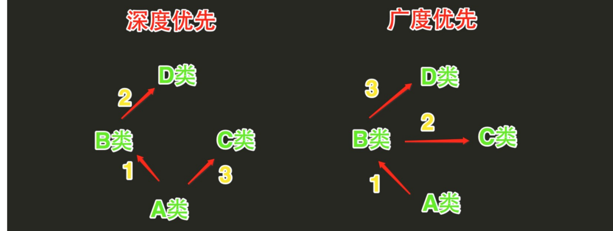

# 类的继承

### 类继承的顺序

    经典类:深度优先
    新式类:广度优先

    
### Python3 默认广度优先-新式类

```python
#!/usr/bin/env python
# -*- coding:utf8 -*-
class A:
    attr = 1


class B(A):
    pass


class C(A):
    attr = 2


class D(B, C):
    pass


if __name__ == '__main__':
    x = D()
    print(x.attr)       # 2
    
    
#明确解决冲突
class A:
    attr = 1


class B(A):
    pass


class C(A):
    attr = 2


class D(B, C):
    attr = B.attr


if __name__ == '__main__':
    x = D()
    print(x.attr)  #  1

```

#### 代码示例 1
```
#!/usr/bin/env python
#-*- coding:utf8 -*-
class Ant:

    def __init__(self, x=0, y=0, color="black"):  #定义构造方法，将实例属性和参数一一绑定
        self.x = x
        self.y = y
        self.color = color

    def crawl(self,x,y):
        self.x = x
        self.y = y
        print("爬行....")
        self.info()

    def info(self):
        print("当前位置({}，{})".format(self.x, self.y))

    def attack(self):
        '模拟攻击'
        print("用嘴咬")

class FlyAnt(Ant):
    '''
    定义FlyAnt类，继承Ant类
    '''
    def attack(self):
        '修改行为，攻击方法不同'
        print("用尾针..！")

    def fly(self,x,y):
        print("飞行.....")
        self.x = x
        self.y = y
        self.info()
flyant = FlyAnt(color="red")   #实例化类
flyant.crawl(3,5)              #模拟爬行
flyant.fly(20,30)              #模拟飞行
flyant.attack()                #模拟攻击

```
### 类的多重继承，同时继承多个类的顺序

#### 代码示例 2
```
#!/usr/bin/env python
#-*- coding:utf8 -*-
"""
经典类:深度优先
新式类:广度优先
"""
class PrntA:
    namea = 'PrntA'
    def set_value(self,a):
        self.a = a

    def set_name(self,namea):
        PrntA.namea = namea

    def info(self):
        print("PrntA：{}，{}".format(PrntA.namea,self.a))

class PrntB:
    nameb = "PrntB"
    def set_nameb(self,nameb):
        PrntB.nameb = nameb

    def info(self):
        print("PrntB:{}".format(PrntB.nameb))

class Sub(PrntA,PrntB):
    pass

class Sub2(PrntB,PrntA):
    pass

class Sub3(PrntA,PrntB):
    def info(self):
        PrntA.info(self)
        PrntB.info(self)

print()
print("使用第一个子类：")
sub = Sub()
sub.set_value("aaaaa")
sub.info()
sub.set_nameb("BBBB")
sub.info()

print()
print("使用第二个子类：")
sub2 = Sub2()               #实例化类Sub2
sub2.set_value("aaaa")
sub2.info()
sub2.set_nameb("BBBBB")
sub2.info()

print()
print("使用第三个子类：")
sub3 = Sub3()               #实例化类Sub2
sub3.set_value("aaaa")
sub.info()
sub3.set_nameb("BBBB")
sub.info()


```