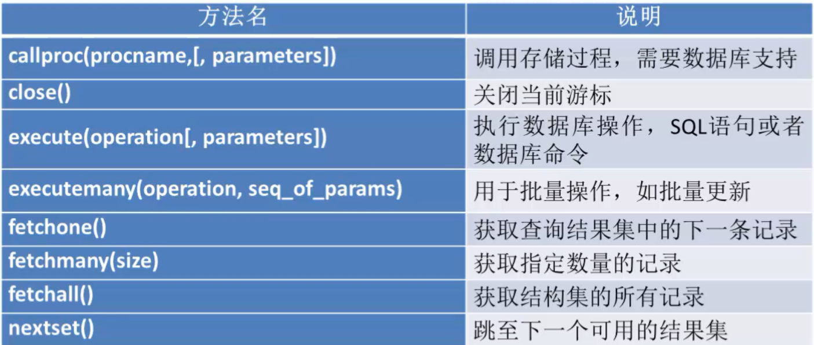

# python操作mysql数据库

### python连接mysql数据库
+ pymysql中conn对象常用的方法如下：




执行流程如下：

#### 代码示例
```
#!/usr/bin/env python
# -*- coding: utf-8 -*-
__author__ = 'xiaojian'
import pymysql
#连接数据库
    参数1：mysql服务所在主机的IP
    参数2：用户名
    参数3：密码
    参数4：要连接的数据库名

# db = pymysql.connect('localhost','root','123456','ttmgrportal')
db = pymysql.connect('192.168.2.122','root','123456','ttmgrportal')
#创建一个cursor对象(用于执行sql语句)
cursor = db.cursor()
sql = "select version()"

#执行sql语句
cursor.execute(sql)

#获取返回的信息
data = cursor.fetchone()
print(data)

#断开
cursor.close()
db.close()

```

### python创建数据库表
#### 代码示例 1
```
#!/usr/bin/env python
# -*- coding: utf-8 -*-
__author__ = 'xiaojian'
import pymysql
db = pymysql.connect('192.168.2.122','root','123456','ttmgrportal')
cursor = db.cursor()

#检查表是否存在，如果存在则删除
cursor.execute("drop table if EXISTS student4")

#创建表
sql = "create TABLE  student4(id INT auto_increment PRIMARY " \
      "KEY ,money int NOT  NULL )"

cursor.execute(sql)


#断开
cursor.close()
db.close()


```

#### 代码示例2
```
#!/usr/bin/env python
#-*- coding:utf8 -*-

#导入PyMySQL模块
import pymysql

#调用connect()函数生成connection连接对象
db = pymysql.connect(host="39.96.10.11", user="hujianli",
                     password="admin#123", database="test_hu",
                     charset="utf8")

#调用cursor()方法，创建Cursor对象
cursor = db.cursor()
cursor.execute("drop table if EXISTS students2")
#执行SQL语句

sql = '''
create table students2(id int auto_increment primary key,name varchar(20) not null,
age int not null ,gender bit default 1,address varchar(20),isDelete bit default 0);
"""
sql2 = '''
CREATE TABLE users (
  'name' varchar(32) NOT NULL,
  'age' int(10) unsigned NOT NULL DEFAULT '0',
  PRIMARY KEY ('name')
) ENGINE=InnoDB DEFAULT CHARSET=utf8
'''
"""
cursor.execute(sql)

#关闭连接
cursor.close()
db.close()

```
### 数据库插入语句
#### 代码示例
```

#!/usr/bin/env python
# -*- coding: utf-8 -*-
__author__ = 'xiaojian'
import pymysql
db = pymysql.connect('192.168.2.122','root','123456','ttmgrportal')
cursor = db.cursor()

#插入数据，捕获异常
sql = "insert into student4 VALUES(3,110),(4,220)"
try:
    cursor.execute(sql)
    #提交事务
    db.commit()
except:
    #如果提交失败，回滚到上一次的数据
    db.rollback()

cursor.close()
db.close()

```
```
#!/usr/bin/env python
#-*- coding:utf8 -*-
"""
操作mysql：增删改查
"""

#!/usr/bin/env python
#-*- coding:utf8 -*-

#导入PyMySQL模块
import pymysql

#调用connect()函数生成connection连接对象
db = pymysql.connect(host="39.96.10.11", user="hujianli",
                     password="admin#123", database="test_hu",
                     charset="utf8")

#调用cursor()方法，创建Cursor对象
cursor = db.cursor()
data = ('1','hujianli')
#执行SQL语句
sql = "insert into sheng(s_id,s_name) values(%s,%s)"
cursor.execute(sql, data)


#关闭连接
cursor.close()
db.close()

```

### 数据库更新操作
#### 代码示例
```
#!/usr/bin/env python
# -*- coding: utf-8 -*-
__author__ = 'xiaojian'
import pymysql

db = pymysql.connect("127.0.0.1","root","123456","ttmgrportal")
cursor = db.cursor()


sql = "UPDATE student4 set money=15000 WHERE id=1"
try:
    cursor.execute(sql)
    db.commit()
except:
    db.rollback()

cursor.close()
db.close()
```
### 数据库删除操作
#### 代码示例
```
#!/usr/bin/env python
# -*- coding: utf-8 -*-
__author__ = 'xiaojian'
import pymysql

db = pymysql.connect("127.0.0.1","root","123456","ttmgrportal")
cursor = db.cursor()


sql = "delete from student4 WHERE money = 110"
try:
    cursor.execute(sql)
    db.commit()
except:
    db.rollback()

cursor.close()
db.close()
```
### 数据库查询操作
#### 代码示例
```
#!/usr/bin/env python
# -*- coding: utf-8 -*-
__author__ = 'xiaojian'
"""
fetchone()
功能:获取下一个查询结果集，结果集是一个对象

fetchall()
功能：接收全部的返回的行

rowcount:是一个只读属性，返回execute()方法影响的行数
"""
import pymysql

db = pymysql.connect("127.0.0.1","root","123456","ttmgrportal")
cursor = db.cursor()


sql = "select * from student4 where money>100"
try:
    cursor.execute(sql)
    reslist = cursor.fetchall()
    for row in reslist:
        print("%d -- %d"%(row[0], row[1]))
except:
    #如果提交失败，回滚到上一次数据
    db.rollback()

cursor.close()
db.close()
```